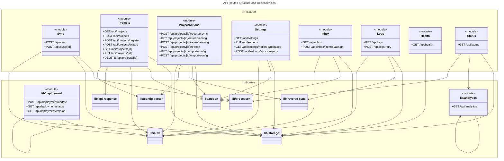

# C4 Code Level: API Routes (app/api)

## Overview
- **Name**: API Routes Layer
- **Description**: RESTful API endpoints for project management, synchronization, configuration, settings, and system monitoring. Built with Next.js App Router, provides authenticated access to core platform functionality.
- **Location**: `/app/api/` in [Nsma Repository](../../)
- **Language**: JavaScript/Node.js (Next.js 14+ with App Router)
- **Purpose**: Exposes REST endpoints for frontend applications and external clients to interact with projects, sync operations, Notion integration, settings management, and system health monitoring.

## Code Elements

### Sync Operations

#### `POST /api/sync`
- **Handler**: `handlePost()`
- **Location**: `/app/api/sync/route.js:7-17`
- **Authentication**: Protected with `withAuth` middleware (Bearer token required)
- **Description**: Triggers full synchronization across all projects
- **Request Body**: None
- **Response**:
  ```json
  { "success": true, "results": {...} }
  ```
- **Dependencies**:
  - `SyncProcessor` from `@/lib/processor`
  - `jsonError` from `@/lib/api-response`
  - `withAuth` from `@/lib/auth`

#### `POST /api/sync/[id]`
- **Handler**: `handlePost(request, { params })`
- **Location**: `/app/api/sync/[id]/route.js:12-26`
- **Parameters**: `id` (project ID from path)
- **Authentication**: Protected with `withAuth` middleware (Bearer token required)
- **Description**: Triggers synchronization for a specific project identified by project ID
- **Response**:
  ```json
  { "success": true, "results": {...} }
  ```
- **Error Handling**: Returns 404 if project not found
- **Dependencies**:
  - `SyncProcessor` from `@/lib/processor`
  - `getProject` from `@/lib/storage`
  - `jsonError` from `@/lib/api-response`
  - `withAuth` from `@/lib/auth`

### Projects Management

#### `GET /api/projects`
- **Handler**: `GET(request)`
- **Location**: `/app/api/projects/route.js:7-32`
- **Query Parameters**: `refresh=true` (optional, forces fresh stats calculation)
- **Authentication**: No authentication required
- **Description**: Lists all registered projects with optional stat refresh capability
- **Response**:
  ```json
  [{ "id": "...", "name": "...", "slug": "...", "stats": {...} }, ...]
  ```
- **Caching**: 60-second cache (unless refresh=true)
- **Dependencies**:
  - `getProjects, createProject, getSettings, countPrompts, updateProject` from `@/lib/storage`
  - `NotionClient` from `@/lib/notion`
  - `jsonWithCache, CACHE_DURATIONS` from `@/lib/api-response`

#### `POST /api/projects`
- **Handler**: `handlePost(request)`
- **Location**: `/app/api/projects/route.js:35-60`
- **Authentication**: Protected with `withAuth` middleware (Bearer token required)
- **Description**: Creates a new project and auto-syncs project slugs to Notion database
- **Request Body**:
  ```json
  { "name": "...", "slug": "...", "promptsPath": "...", "stats": {...} }
  ```
- **Response**:
  ```json
  { "id": "...", "name": "...", "slug": "...", "status": 201 }
  ```
- **Side Effects**: Auto-syncs project options to Notion (non-fatal if fails)
- **Dependencies**:
  - `getProjects, createProject, getSettings, updateProject` from `@/lib/storage`
  - `NotionClient` from `@/lib/notion`
  - `jsonError` from `@/lib/api-response`

#### `POST /api/projects/register`
- **Handler**: `POST(request)`
- **Location**: `/app/api/projects/register/route.js:10-127`
- **Authentication**: Requires registration token via `verifyRegistrationToken(request)`
- **Description**: Registers new project with multi-step setup including validation, directory creation, config auto-import, and Notion sync
- **Request Body**:
  ```json
  {
    "name": "string",
    "slug": "string",
    "promptsPath": "string",
    "active": "boolean (optional)",
    "phases": "array (optional)",
    "modules": "array (optional)",
    "modulePhaseMapping": "object (optional)"
  }
  ```
- **Response**:
  ```json
  {
    "success": true,
    "project": {...},
    "created": true,
    "directoriesCreated": [...]
  }
  ```
- **Processing Steps**:
  1. Authenticate with registration token
  2. Validate request body
  3. Check if project exists (idempotent)
  4. Create directory structure
  5. Create project record
  6. Auto-import config from docs (if available)
  7. Auto-sync project slugs to Notion
- **Error Handling**: Comprehensive validation with specific error messages for each step
- **Dependencies**:
  - `verifyRegistrationToken` from `@/lib/auth`
  - `validateProjectRegistration, findProjectBySlug` from `@/lib/validation`
  - `createProject, updateProject, getSettings, getProjects` from `@/lib/storage`
  - `createProjectDirectories` from `@/lib/setup`
  - `NotionClient` from `@/lib/notion`
  - `ConfigParser` from `@/lib/config-parser`

#### `POST /api/projects/wizard`
- **Handler**: `POST(request)`
- **Location**: `/app/api/projects/wizard/route.js:13-44`
- **Authentication**: No authentication required
- **Description**: Multi-action wizard endpoint supporting project setup with four action types
- **Supported Actions**:
  1. `generate-defaults`: Generate default project values from PROJECT_ROOT
  2. `validate-paths`: Validate project paths and return corrections
  3. `detect-config`: Detect configuration files in project directory
  4. `create-project`: Full project creation with setup
- **Request Body**:
  ```json
  {
    "action": "generate-defaults|validate-paths|detect-config|create-project",
    "projectRoot": "string",
    "promptsPath": "string (optional)",
    "name": "string",
    "slug": "string",
    "importConfig": "boolean",
    "hookStyle": "string",
    "createConfigTemplate": "boolean"
  }
  ```
- **Response**: Varies by action
- **Dependencies**:
  - `generateProjectDefaults, validatePaths, detectConfigFiles, runWizardProgrammatic` from `@/lib/wizard`

#### `GET /api/projects/[id]`
- **Handler**: `GET(request, { params })`
- **Location**: `/app/api/projects/[id]/route.js:7-18`
- **Parameters**: `id` (project ID from path)
- **Authentication**: No authentication required
- **Description**: Retrieves a specific project by ID
- **Response**:
  ```json
  { "id": "...", "name": "...", "slug": "...", ...projectData }
  ```
- **Error Handling**: Returns 404 if project not found
- **Dependencies**:
  - `getProject` from `@/lib/storage`
  - `jsonError` from `@/lib/api-response`

#### `PUT /api/projects/[id]`
- **Handler**: `handlePut(request, { params })`
- **Location**: `/app/api/projects/[id]/route.js:21-51`
- **Parameters**: `id` (project ID from path)
- **Authentication**: Protected with `withAuth` middleware (Bearer token required)
- **Description**: Updates a project's properties, auto-syncs to Notion if slug changes
- **Request Body**:
  ```json
  { "name": "...", "slug": "...", "promptsPath": "...", ...updateFields }
  ```
- **Response**: Updated project object
- **Side Effects**: Auto-syncs to Notion if slug is modified
- **Dependencies**:
  - `getProject, updateProject, getSettings, getProjects` from `@/lib/storage`
  - `NotionClient` from `@/lib/notion`
  - `jsonError` from `@/lib/api-response`

#### `DELETE /api/projects/[id]`
- **Handler**: `handleDelete(request, { params })`
- **Location**: `/app/api/projects/[id]/route.js:54-63`
- **Parameters**: `id` (project ID from path)
- **Authentication**: Protected with `withAuth` middleware (Bearer token required)
- **Description**: Deletes a project (orphaned items move to Inbox)
- **Response**:
  ```json
  { "success": true }
  ```
- **Note**: Notion database is not updated; orphaned items go to Inbox
- **Dependencies**:
  - `deleteProject` from `@/lib/storage`
  - `jsonError` from `@/lib/api-response`

#### `POST /api/projects/[id]/reverse-sync`
- **Handler**: `handlePost(request, { params })`
- **Location**: `/app/api/projects/[id]/reverse-sync/route.js:14-122`
- **Parameters**: `id` (project ID from path)
- **Authentication**: Protected with `withAuth` middleware (Bearer token required)
- **Description**: Manually triggers reverse sync from local folder locations to Notion page statuses
- **Response**:
  ```json
  {
    "success": true,
    "projectId": "...",
    "result": {
      "updated": number,
      "failed": number,
      "skipped": number,
      "errors": [...]
    },
    "syncedAt": "ISO timestamp"
  }
  ```
- **Prerequisites**:
  - Reverse sync enabled on project
  - Notion token configured
- **Special Features**:
  - API warm-up call to Notion database (handles API quirk)
  - Detailed error tracking with error type labels
  - Comprehensive activity logging with error details
- **Error Modes**:
  - `permission`: Permission denied on Notion page
  - `deleted`: Notion page was deleted
- **Dependencies**:
  - `getProject, getSettings, updateProject, logInfo, logWarn` from `@/lib/storage`
  - `NotionClient` from `@/lib/notion`
  - `ReverseSyncProcessor` from `@/lib/reverse-sync`
  - `jsonError` from `@/lib/api-response`

#### `GET /api/projects/[id]/refresh-config`
- **Handler**: `GET(request, { params })`
- **Location**: `/app/api/projects/[id]/refresh-config/route.js:48-74`
- **Parameters**: `id` (project ID from path)
- **Authentication**: No authentication required
- **Description**: Checks if project configuration has changed since last import
- **Response**:
  ```json
  {
    "projectId": "...",
    "projectName": "...",
    "hasChanges": boolean,
    "lastImportedAt": "ISO timestamp",
    "configSource": "string"
  }
  ```
- **Dependencies**:
  - `getProject` from `@/lib/storage`
  - `ConfigWatcher` from `@/lib/config-watcher`
  - `jsonError` from `@/lib/api-response`

#### `POST /api/projects/[id]/refresh-config`
- **Handler**: `handlePost(request, { params })`
- **Location**: `/app/api/projects/[id]/refresh-config/route.js:12-42`
- **Parameters**: `id` (project ID from path)
- **Authentication**: Protected with `withAuth` middleware (Bearer token required)
- **Description**: Manually trigger configuration refresh for a project
- **Response**:
  ```json
  {
    "message": "Config refreshed successfully",
    ...changeDetails
  }
  ```
- **Error Handling**: Returns 404 if project not found, 400 if refresh fails
- **Dependencies**:
  - `getProject` from `@/lib/storage`
  - `ConfigWatcher` from `@/lib/config-watcher`
  - `jsonError` from `@/lib/api-response`

#### `POST /api/projects/[id]/refresh`
- **Handler**: `POST(request, { params })`
- **Location**: `/app/api/projects/[id]/refresh/route.js:9-31`
- **Parameters**: `id` (project ID from path)
- **Authentication**: No authentication required
- **Description**: Manually refresh project statistics from disk
- **Response**:
  ```json
  {
    "success": true,
    "projectId": "...",
    "stats": {...},
    "refreshedAt": "ISO timestamp"
  }
  ```
- **Dependencies**:
  - `refreshProjectStats, getProject` from `@/lib/storage`

#### `GET /api/projects/[id]/import-config`
- **Handler**: `GET(request, { params })`
- **Location**: `/app/api/projects/[id]/import-config/route.js:11-70`
- **Parameters**: `id` (project ID from path)
- **Authentication**: No authentication required
- **Description**: Preview configuration files that would be imported without saving
- **Response**:
  ```json
  {
    "available": boolean,
    "files": ["config-filename1", "config-filename2"],
    "preview": {
      "phases": [...],
      "modules": [...],
      "modulePhaseMapping": {...},
      "source": "config-filename"
    },
    "changes": {
      "phasesAdded": number,
      "modulesAdded": number
    }
  }
  ```
- **Dependencies**:
  - `getProject, getProjectRoot` from `@/lib/storage`
  - `ConfigParser` from `@/lib/config-parser`
  - `jsonError` from `@/lib/api-response`

#### `POST /api/projects/[id]/import-config`
- **Handler**: `handlePost(request, { params })`
- **Location**: `/app/api/projects/[id]/import-config/route.js:77-140`
- **Parameters**: `id` (project ID from path)
- **Authentication**: Protected with `withAuth` middleware (Bearer token required)
- **Description**: Import configuration from project documentation files and update project
- **Response**:
  ```json
  {
    "success": true,
    "project": {...},
    "imported": {
      "phases": number,
      "modules": number,
      "source": "string"
    }
  }
  ```
- **Error Handling**: Returns specific errors for missing project, missing promptsPath, or parse errors
- **Dependencies**:
  - `getProject, updateProject, getProjectRoot` from `@/lib/storage`
  - `ConfigParser` from `@/lib/config-parser`
  - `jsonError` from `@/lib/api-response`

### Settings Management

#### `GET /api/settings`
- **Handler**: `GET()`
- **Location**: `/app/api/settings/route.js:6-22`
- **Authentication**: No authentication required
- **Description**: Retrieves application settings with masked sensitive tokens
- **Response**:
  ```json
  {
    "notionToken": "••••••••••••",
    "notionDatabaseId": "...",
    "anthropicApiKey": "••••••••••••",
    "geminiApiKey": "••••••••••••",
    "hasNotionToken": boolean,
    "hasAnthropicKey": boolean,
    "hasGeminiKey": boolean,
    ...otherSettings
  }
  ```
- **Security**: Token values are masked (never exposed)
- **Caching**: 5-second cache
- **Dependencies**:
  - `getSettings` from `@/lib/storage`
  - `jsonWithCache, CACHE_DURATIONS` from `@/lib/api-response`

#### `PUT /api/settings`
- **Handler**: `handlePut(request)`
- **Location**: `/app/api/settings/route.js:25-48`
- **Authentication**: Protected with `withAuth` middleware (Bearer token required)
- **Description**: Updates application settings, preventing token overwrite via masked values
- **Request Body**:
  ```json
  {
    "notionToken": "string (optional)",
    "notionDatabaseId": "string (optional)",
    "anthropicApiKey": "string (optional)",
    "geminiApiKey": "string (optional)",
    ...otherSettings
  }
  ```
- **Response**: Updated settings object (with masked tokens)
- **Security**: Prevents overwriting tokens if masked value (••••) is sent
- **Dependencies**:
  - `getSettings, saveSettings` from `@/lib/storage`
  - `jsonError` from `@/lib/api-response`

#### `GET /api/settings/notion-databases`
- **Handler**: `GET()`
- **Location**: `/app/api/settings/notion-databases/route.js:9-42`
- **Authentication**: No authentication required
- **Description**: Lists all Notion databases accessible to the configured integration
- **Response**:
  ```json
  {
    "databases": [
      { "id": "...", "name": "...", ...dbProperties }
    ],
    "currentDatabaseId": "...",
    "error": "string (if any)"
  }
  ```
- **Error Handling**: Provides user-friendly error messages for auth failures
- **Status Code**: Always returns 200 (errors in response body)
- **Dependencies**:
  - `getSettings` from `@/lib/storage`
  - `NotionClient` from `@/lib/notion`

#### `POST /api/settings/sync-projects`
- **Handler**: `handlePost()`
- **Location**: `/app/api/settings/sync-projects/route.js:12-132`
- **Authentication**: Protected with `withAuth` middleware (Bearer token required)
- **Description**: Syncs project slugs, modules, and phases to Notion database dropdown options, creates/updates project slugs page
- **Response**:
  ```json
  {
    "success": true,
    "projects": {
      "added": ["slug1", "slug2"],
      "existing": ["slug3"]
    },
    "modules": {
      "added": ["module1"],
      "existing": ["module2"]
    },
    "phases": {
      "suggestedPhase": { "added": [...], "existing": [...] },
      "assignedPhase": { "added": [...], "existing": [...] }
    },
    "slugsPage": {
      "pageId": "...",
      "created": boolean
    },
    "message": "Added X project(s), Y module(s), Z phase(s) to Notion"
  }
  ```
- **Sync Targets**:
  1. Project slugs → Notion dropdown
  2. Modules → "Affected Module" property
  3. Phases → "Suggested Phase" and "Assigned Phase" properties
  4. Project slugs metadata → Dedicated Notion page
- **Side Effects**: Saves projectSlugsPageId to settings if newly created
- **Dependencies**:
  - `getProjects, getSettings, saveSettings` from `@/lib/storage`
  - `NotionClient` from `@/lib/notion`
  - `jsonError` from `@/lib/api-response`

### Inbox Management

#### `GET /api/inbox`
- **Handler**: `GET()`
- **Location**: `/app/api/inbox/route.js:4-17`
- **Authentication**: No authentication required
- **Description**: Retrieves all inbox items and statistics
- **Response**:
  ```json
  {
    "items": [
      {
        "id": "...",
        "filename": "...",
        "title": "...",
        "notionPageId": "...",
        ...itemData
      }
    ],
    "stats": {...},
    "count": number
  }
  ```
- **Caching**: 10-second cache
- **Dependencies**:
  - `getInboxItems, getInboxStats` from `@/lib/storage`
  - `jsonWithCache, CACHE_DURATIONS` from `@/lib/api-response`

#### `POST /api/inbox/[itemId]/assign`
- **Handler**: `handlePost(request, { params })`
- **Location**: `/app/api/inbox/[itemId]/assign/route.js:12-61`
- **Parameters**: `itemId` (inbox item ID or filename)
- **Authentication**: Protected with `withAuth` middleware (Bearer token required)
- **Description**: Assigns an inbox item to a project (moves file and updates Notion)
- **Request Body**:
  ```json
  { "projectId": "string" }
  ```
- **Response**:
  ```json
  {
    "success": true,
    "message": "Assigned 'item-title' to project-name",
    ...moveResult
  }
  ```
- **Processing**:
  1. Validate inbox item exists
  2. Validate target project exists
  3. Update Notion page (if notionPageId exists)
  4. Move file to project folder
- **Error Handling**: Returns 404 for missing item/project, 400 for missing projectId
- **Dependencies**:
  - `getInboxItems, moveInboxItemToProject, getProject, getSettings` from `@/lib/storage`
  - `NotionClient` from `@/lib/notion`
  - `jsonError` from `@/lib/api-response`

### Logs and Activity

#### `GET /api/logs`
- **Handler**: `GET(request)`
- **Location**: `/app/api/logs/route.js:12-30`
- **Query Parameters**:
  - `limit`: number (1-500, default: 50)
  - `level`: 'info' | 'warn' | 'error' (optional)
- **Authentication**: No authentication required
- **Description**: Retrieves activity logs with optional filtering by level
- **Response**:
  ```json
  [
    {
      "timestamp": "ISO timestamp",
      "level": "info|warn|error",
      "operation": "...",
      "message": "...",
      ...logData
    }
  ]
  ```
- **Order**: Most recent first
- **Validation**: Enforces limit boundaries (1-500)
- **Caching**: 5-second cache
- **Dependencies**:
  - `getLogs` from `@/lib/storage`
  - `validateQueryLimit` from `@/lib/validation`
  - `jsonWithCache, jsonError` from `@/lib/api-response`

#### `POST /api/logs/retry`
- **Handler**: `handlePost(request)`
- **Location**: `/app/api/logs/retry/route.js:14-59`
- **Authentication**: Protected with `withAuth` middleware (Bearer token required)
- **Description**: Retries failed reverse sync for a specific project
- **Request Body**:
  ```json
  { "projectId": "string" }
  ```
- **Response**:
  ```json
  {
    "success": true,
    "result": {
      "updated": number,
      "failed": number,
      "skipped": number
    },
    "message": "Retry completed with X failure(s)|Successfully synced Y file(s) to Notion"
  }
  ```
- **Error Handling**: Returns 400 if missing projectId, 404 if project not found
- **Dependencies**:
  - `getProject, getSettings` from `@/lib/storage`
  - `NotionClient` from `@/lib/notion`
  - `ReverseSyncProcessor` from `@/lib/reverse-sync`
  - `jsonError` from `@/lib/api-response`

### System Status and Health

#### `GET /api/health`
- **Handler**: `GET()`
- **Location**: `/app/api/health/route.js:9-23`
- **Authentication**: No authentication required
- **Description**: Health check endpoint for Docker container monitoring
- **Response**:
  ```json
  {
    "status": "healthy|unhealthy",
    "timestamp": "ISO timestamp",
    "configDir": boolean,
    "nodeEnv": "development|production"
  }
  ```
- **Status Codes**: 200 (healthy), 503 (unhealthy)
- **Health Criteria**: CONFIG_DIR must exist
- **Use Cases**: Docker HEALTHCHECK, external monitoring tools
- **Dependencies**:
  - `existsSync` from `fs`
  - `CONFIG_DIR` from `@/lib/constants`

#### `GET /api/status`
- **Handler**: `GET()`
- **Location**: `/app/api/status/route.js:11-83`
- **Authentication**: No authentication required
- **Description**: Returns comprehensive sync system status with daemon state and 24-hour metrics
- **Response**:
  ```json
  {
    "daemon": {
      "running": boolean,
      "uptime": "ISO timestamp",
      "status": "..."
    },
    "metrics": {
      "syncsLast24h": number,
      "itemsLast24h": number,
      "errorsLast24h": number,
      "lastSync": {...},
      "successRate": number
    },
    "recentLogs": [...],
    "syncIntervalMinutes": number,
    "nextSyncAt": "ISO timestamp",
    "lastCheckAt": "ISO timestamp"
  }
  ```
- **Calculation Details**:
  - Daemon status cached (30s TTL) to reduce shell spawns
  - Sync timing calculated from daemon startup + interval alignment
  - Success rate computed from 24-hour error logs
- **Caching**: 5-second cache
- **Dependencies**:
  - `getLogs, getSettings` from `@/lib/storage`
  - `getDaemonStatus` from `@/lib/daemon-cache`
  - `jsonWithCache, jsonError` from `@/lib/api-response`

### Analytics

#### `GET /api/analytics`
- **Handler**: `GET(request)`
- **Location**: `/app/api/analytics/route.js:4-21`
- **Query Parameters**: `range` (7d | 30d | 90d | all, default: 30d)
- **Authentication**: No authentication required
- **Description**: Returns analytics data for specified time range
- **Response**:
  ```json
  {
    "syncs": [...],
    "itemsProcessed": [...],
    "successRate": [...],
    ...analyticsData
  }
  ```
- **Validation**: Only accepts valid range values
- **Caching**: 1-hour cache
- **Dependencies**:
  - `getAnalyticsData` from `@/lib/analytics`
  - `jsonWithCache, jsonError` from `@/lib/api-response`

### Deployment Management

#### `POST /api/deployment/update`
- **Handler**: `POST(request)`
- **Location**: `/app/api/deployment/update/route.js:23-133`
- **Authentication**: Requires registration token via `verifyRegistrationToken(request)`
- **Description**: Triggers application update process with automatic version management and rollback support
- **Response**:
  ```json
  {
    "success": true|false,
    "message": "string",
    "updated": boolean,
    "previousVersion": "string",
    "newVersion": "string",
    "commitCount": number,
    "rolledBack": boolean,
    "rollbackCommit": "string"
  }
  ```
- **Processing Steps**:
  1. Authenticate with registration token
  2. Check for available updates
  3. Execute update (git pull, npm install, npm run build)
  4. Record update in history
  5. Schedule service restart (2 second delay)
- **Update History**:
  - Keeps last 20 update records
  - Records both successful and failed updates
  - Stores commit information for successful updates
- **Restart Strategy**: Allows response to be sent before restarting (2s delay)
- **Dependencies**:
  - `verifyRegistrationToken` from `@/lib/auth`
  - `executeUpdate, getCurrentVersion, checkForUpdates, scheduleServiceRestart` from `@/lib/deployment`
  - `getSettings, saveSettings` from `@/lib/storage`
  - `jsonError` from `@/lib/api-response`

#### `GET /api/deployment/status`
- **Handler**: `GET()`
- **Location**: `/app/api/deployment/status/route.js:9-24`
- **Authentication**: No authentication required
- **Description**: Returns deployment instance information and update history
- **Response**:
  ```json
  {
    "instance": {...},
    "updateHistory": [...],
    "lastUpdateCheck": "ISO timestamp"
  }
  ```
- **Caching**: 30-second cache
- **Dependencies**:
  - `getSettings` from `@/lib/storage`
  - `getInstanceInfo` from `@/lib/deployment`
  - `jsonWithCache, jsonError` from `@/lib/api-response`

#### `GET /api/deployment/version`
- **Handler**: `GET()`
- **Location**: `/app/api/deployment/version/route.js:8-38`
- **Authentication**: No authentication required
- **Description**: Returns current version, commit hash, and available updates
- **Response**:
  ```json
  {
    "currentVersion": "string",
    "currentCommit": "string",
    "hasUpdates": boolean,
    "latestCommit": "string",
    "commitCount": number,
    "commits": [...],
    "instance": {...},
    "checkedAt": "ISO timestamp",
    "updateCheckError": "string (if any)"
  }
  ```
- **Parallel Queries**: Uses Promise.all for efficient data gathering
- **Error Handling**: Gracefully handles update check failures
- **Caching**: 60-second cache
- **Dependencies**:
  - `getCurrentVersion, getCurrentCommit, checkForUpdates, getInstanceInfo` from `@/lib/deployment`
  - `jsonWithCache, jsonError` from `@/lib/api-response`

## Dependencies

### Internal Dependencies
- `@/lib/storage`: Project, settings, logs, inbox, analytics data access
- `@/lib/processor`: SyncProcessor for bulk synchronization
- `@/lib/reverse-sync`: ReverseSyncProcessor for reverse sync operations
- `@/lib/notion`: NotionClient for Notion API integration
- `@/lib/auth`: Authentication middleware (withAuth, verifyRegistrationToken)
- `@/lib/api-response`: Response formatters (jsonError, jsonWithCache, CACHE_DURATIONS)
- `@/lib/config-parser`: Configuration file parsing and detection
- `@/lib/config-watcher`: Configuration change detection
- `@/lib/setup`: Project directory creation
- `@/lib/validation`: Input validation (validateProjectRegistration, findProjectBySlug, validateQueryLimit)
- `@/lib/wizard`: Project setup wizard functions
- `@/lib/deployment`: Version and update management
- `@/lib/analytics`: Analytics data aggregation
- `@/lib/daemon-cache`: Cached daemon status with TTL
- `@/lib/constants`: CONFIG_DIR and other constants

### External Dependencies
- `next/server`: NextResponse, request/response handling

## Authentication Strategy

### Protected Routes (withAuth Middleware)
Protected routes require HTTP Bearer token in Authorization header. The `withAuth` middleware validates tokens before handler execution.

**Protected Endpoints**:
- `POST /api/sync`
- `POST /api/sync/[id]`
- `POST /api/projects`
- `PUT /api/projects/[id]`
- `DELETE /api/projects/[id]`
- `POST /api/projects/[id]/reverse-sync`
- `POST /api/projects/[id]/refresh-config`
- `POST /api/projects/[id]/import-config`
- `PUT /api/settings`
- `POST /api/settings/sync-projects`
- `POST /api/inbox/[itemId]/assign`
- `POST /api/logs/retry`

### Registration Token Routes
Require registration token authentication via `verifyRegistrationToken()`:
- `POST /api/projects/register`
- `POST /api/deployment/update`

### Public Routes (No Authentication)
- `GET /api/projects` (list all)
- `GET /api/projects/[id]` (get single)
- `GET /api/settings`
- `GET /api/settings/notion-databases`
- `GET /api/inbox`
- `GET /api/logs`
- `GET /api/health`
- `GET /api/status`
- `GET /api/analytics`
- `GET /api/deployment/status`
- `GET /api/deployment/version`
- `POST /api/projects/wizard`

## Caching Strategy

### Cache Durations (from CACHE_DURATIONS constant)
- **Projects**: 60 seconds
- **Settings**: 5 seconds
- **Inbox**: 10 seconds
- **Logs**: 5 seconds
- **Status**: 5 seconds
- **Analytics**: 1 hour (3600 seconds)
- **Deployment**: 30-60 seconds

### Cache Headers
All cached responses use `jsonWithCache()` utility which sets appropriate HTTP cache headers.

### Cache Bypass
- Mutations (POST, PUT, DELETE) never use cache
- `GET /api/projects?refresh=true` forces fresh data

## Error Handling

### Standardized Error Responses
All error responses use `jsonError()` utility from `@/lib/api-response`:
- HTTP Status Codes: 400 (validation), 401 (auth), 404 (not found), 500 (server error)
- Response Format: `{ "error": "message", "details": "..." }`

### Specific Error Types

**Validation Errors** (400):
- Missing required fields
- Invalid parameter values
- Invalid project configuration

**Authentication Errors** (401):
- Invalid or missing bearer token
- Invalid registration token

**Not Found Errors** (404):
- Project not found
- Inbox item not found
- Configuration files not found

**Server Errors** (500):
- Directory creation failures
- Configuration parsing failures
- Deployment failures

**Notion-Specific Errors**:
- 401: Invalid token
- 403: Access denied
- Graceful degradation (sync failures don't block main operations)

## Relationships

### API Route Hierarchy



## HTTP Methods and Status Codes

### GET Requests
- **200 OK**: Successful data retrieval
- **404 Not Found**: Resource not found
- **500 Internal Server Error**: Server-side error

### POST Requests
- **200 OK**: Successful action completion
- **201 Created**: New resource created
- **400 Bad Request**: Invalid request body or parameters
- **401 Unauthorized**: Authentication failed
- **404 Not Found**: Resource not found
- **500 Internal Server Error**: Server-side error

### PUT Requests
- **200 OK**: Successful update
- **400 Bad Request**: Invalid request body
- **401 Unauthorized**: Authentication failed
- **404 Not Found**: Resource not found
- **500 Internal Server Error**: Server-side error

### DELETE Requests
- **200 OK**: Successful deletion
- **401 Unauthorized**: Authentication failed
- **404 Not Found**: Resource not found
- **500 Internal Server Error**: Server-side error

## Request/Response Patterns

### Pagination
Not explicitly implemented in current API. All endpoints return full datasets. Query limit validation exists for logs endpoint (max 500).

### Query Parameters
- `refresh=true`: Force fresh data (projects endpoint)
- `limit=N`: Control result count (logs endpoint)
- `level=info|warn|error`: Filter logs by level
- `range=7d|30d|90d|all`: Analytics time range

### Request Headers
- `Authorization: Bearer <token>`: For protected endpoints
- `Content-Type: application/json`: For POST/PUT requests with body

### Response Headers
- `Cache-Control`: Set by jsonWithCache() for cacheable endpoints
- `Content-Type: application/json`: All responses

## Notes

### Design Patterns

**Middleware Pattern**: Authentication via `withAuth()` wrapper functions
- Routes define handler functions (handlePost, handlePut, etc.)
- `withAuth` wrapper applies authentication before execution
- Clean separation of auth logic from business logic

**Fail-Safe Integrations**: Non-critical failures don't block main operations
- Notion syncs are best-effort (logged but don't fail requests)
- Config auto-import failures are logged but don't block registration
- Enables robust operation even when external services are unavailable

**Dual Status Checks**: Health and Status endpoints use different strategies
- Health: Simple config directory check (fast, Docker-friendly)
- Status: Full daemon state with metrics (comprehensive, UI-friendly)

**Idempotent Operations**: Project registration checks existing before creating
- Prevents duplicate projects
- Safe to retry failed requests

### Performance Optimizations

1. **Daemon Status Caching**: 30-second TTL reduces shell spawns by ~95%
2. **Computed Metrics**: Dashboard metrics calculated from logs rather than stored
3. **Parallel Queries**: Version endpoint uses Promise.all for concurrent data fetching
4. **Response Caching**: HTTP cache headers reduce downstream computation
5. **Selective Log Retrieval**: Status endpoint pulls only last 50 logs for efficiency

### Security Considerations

1. **Token Masking**: Settings endpoint never exposes actual token values
2. **Token Protection**: Prevents accidental overwrite via masked values
3. **Registration Token**: Separate auth mechanism for project registration
4. **Bearer Token**: Industry-standard HTTP auth for protected operations

### Future Enhancement Opportunities

1. **Pagination**: Implement cursor-based pagination for large datasets
2. **Webhooks**: Event notifications for sync events
3. **Rate Limiting**: Protect endpoints from abuse
4. **Request Logging**: Comprehensive API request/response logging
5. **GraphQL**: Consider GraphQL interface alongside REST
6. **OpenAPI Spec**: Auto-generated API documentation

## File Manifest

| File | Endpoint(s) | Methods | Auth |
|------|-----------|---------|------|
| `/app/api/sync/route.js` | `/api/sync` | POST | Bearer Token |
| `/app/api/sync/[id]/route.js` | `/api/sync/[id]` | POST | Bearer Token |
| `/app/api/projects/route.js` | `/api/projects` | GET, POST | None / Bearer Token |
| `/app/api/projects/register/route.js` | `/api/projects/register` | POST | Registration Token |
| `/app/api/projects/wizard/route.js` | `/api/projects/wizard` | POST | None |
| `/app/api/projects/[id]/route.js` | `/api/projects/[id]` | GET, PUT, DELETE | None / Bearer Token |
| `/app/api/projects/[id]/reverse-sync/route.js` | `/api/projects/[id]/reverse-sync` | POST | Bearer Token |
| `/app/api/projects/[id]/refresh-config/route.js` | `/api/projects/[id]/refresh-config` | GET, POST | None / Bearer Token |
| `/app/api/projects/[id]/refresh/route.js` | `/api/projects/[id]/refresh` | POST | None |
| `/app/api/projects/[id]/import-config/route.js` | `/api/projects/[id]/import-config` | GET, POST | None / Bearer Token |
| `/app/api/settings/route.js` | `/api/settings` | GET, PUT | None / Bearer Token |
| `/app/api/settings/notion-databases/route.js` | `/api/settings/notion-databases` | GET | None |
| `/app/api/settings/sync-projects/route.js` | `/api/settings/sync-projects` | POST | Bearer Token |
| `/app/api/inbox/route.js` | `/api/inbox` | GET | None |
| `/app/api/inbox/[itemId]/assign/route.js` | `/api/inbox/[itemId]/assign` | POST | Bearer Token |
| `/app/api/logs/route.js` | `/api/logs` | GET | None |
| `/app/api/logs/retry/route.js` | `/api/logs/retry` | POST | Bearer Token |
| `/app/api/health/route.js` | `/api/health` | GET | None |
| `/app/api/status/route.js` | `/api/status` | GET | None |
| `/app/api/analytics/route.js` | `/api/analytics` | GET | None |
| `/app/api/deployment/update/route.js` | `/api/deployment/update` | POST | Registration Token |
| `/app/api/deployment/status/route.js` | `/api/deployment/status` | GET | None |
| `/app/api/deployment/version/route.js` | `/api/deployment/version` | GET | None |
