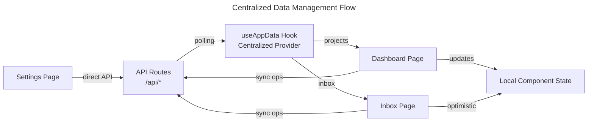
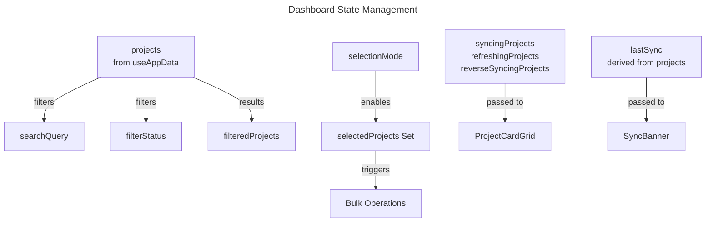

# C4 Code Level: Application Pages

## Overview
- **Name**: Application Pages and Routing
- **Description**: Complete set of Next.js 14+ App Router page components providing the user interface for the Notion Sync Manager. Includes dashboard, settings, project editor, inbox, logs, and analytics pages with centralized data management and state handling.
- **Location**: `/app` (excluding `/app/api`)
- **Language**: TypeScript/JavaScript (React/Next.js 14+)
- **Purpose**: Render the complete application interface with server-side layout scaffolding, client-side interactivity, real-time data synchronization, and comprehensive project management features.

## Code Elements

### Page Components

#### Dashboard Page (Main Page)
**File**: `/app/page.tsx`
**Type**: Client Component (use client)
**Export**: `Dashboard()`

**Signature**:
```typescript
export default function Dashboard(): React.ReactElement
```

**Description**:
Main dashboard page serving as the application's home view. Displays project overview with stats, sync status, inbox summary, and project management interface. Implements:
- Centralized data polling through `useAppData()` hook
- Global and per-project sync/refresh state management
- Project filtering by status and search query
- Selection mode with bulk operations (sync/refresh)
- Real-time sync event detection with toast notifications

**Dependencies**:
- Hooks: `useToast`, `useSyncEvents`, `useProjects`, `useAppData`
- Components: `Header`, `StatsOverview`, `SyncBanner`, `SyncStatusDashboard`, `InboxCard`, `EmptyState`, `Button`, `AddProjectWizard`
- Local Components: `BulkActionBar`, `ProjectListControls`, `ProjectCardGrid`
- Types: `Project`
- External: React hooks (useState, useMemo, useCallback), lucide-react icons

**State Management**:
- `syncing`: boolean - Global sync operation in progress
- `showWizard`: boolean - Add project wizard visibility
- `syncingProjects`: Set<string> - Per-project sync states
- `refreshingProjects`: Set<string> - Per-project refresh states
- `reverseSyncingProjects`: Set<string> - Per-project reverse sync states
- `searchQuery`: string - Search filter value
- `filterStatus`: FilterStatus - Status filter ('all' | 'active' | 'paused')
- `selectionMode`: boolean - Bulk selection mode active
- `selectedProjects`: Set<string> - Selected project IDs
- `bulkSyncing`: boolean - Bulk sync operation in progress
- `bulkRefreshing`: boolean - Bulk refresh operation in progress

**Key Methods**:
- `handleSyncAll(): Promise<void>` - POST /api/sync, updates all projects
- `handleSyncProject(projectId): Promise<void>` - POST /api/sync/{id}, syncs single project
- `handleToggleActive(projectId, active): Promise<void>` - PUT /api/projects/{id}, toggles project active state
- `handleRefreshStats(projectId): Promise<void>` - POST /api/projects/{id}/refresh, refreshes project stats from disk
- `handleRefreshAllStats(): Promise<void>` - GET /api/projects?refresh=true, refreshes all stats
- `handleReverseSync(projectId): Promise<void>` - POST /api/projects/{id}/reverse-sync, syncs files to Notion
- `handleWizardSuccess(): Promise<void>` - Callback when project is created
- `handleToggleSelection(projectId): void` - Toggle project selection for bulk ops
- `handleSelectAll(): void` - Select all filtered projects
- `handleClearSelection(): void` - Clear all selections and exit selection mode
- `handleSelectionModeToggle(): void` - Toggle selection mode
- `handleBulkSync(): Promise<void>` - Execute bulk sync on selected projects
- `handleBulkRefresh(): Promise<void>` - Execute bulk refresh on selected projects

**Derived State**:
- `lastSync`: Date | null - Most recent sync timestamp from all projects
- `filteredProjects`: Project[] - Search and status-filtered project list

---

#### Root Layout
**File**: `/app/layout.jsx`
**Type**: Server Component (Async)
**Export**: `RootLayout({ children })`

**Signature**:
```typescript
export const metadata: Metadata
export default async function RootLayout({ children }): Promise<React.ReactElement>
```

**Description**:
Root layout component for the entire application. Provides the HTML structure, global styling, provider setup, and sidebar navigation. Server-side initial data load for sidebar static content.

**Props**:
- `children`: React.ReactNode - Page content to render in main area

**Dependencies**:
- Components: `Sidebar`, `ClientProviders`
- Functions: `getProjects()` from '@/lib/storage'
- CSS: './globals.css'

**Metadata**:
```typescript
{
  title: 'Notion Sync Manager',
  description: 'Multi-project development inbox processor with Notion integration'
}
```

**Structure**:
- HTML root element with lang="en"
- Body with flex layout
- Sidebar component (receives initial projects)
- Main content area with p-8 padding and overflow-y-auto

---

#### Settings Page
**File**: `/app/settings/page.jsx`
**Type**: Client Component (use client)
**Export**: `Settings()` → `SettingsContent()`

**Signature**:
```typescript
export default function Settings(): React.ReactElement
function SettingsContent(): React.ReactElement
```

**Description**:
Settings configuration page with tabbed interface for managing application settings. Uses URL-based tab routing with Suspense boundary for useSearchParams. Implements:
- Multi-tab settings interface (Notion, Sync, Templates, AI, Advanced, Deployment)
- URL-based active tab state via searchParams
- Settings loading, validation, and persistence
- Project sync to Notion functionality
- Registration token generation

**Tab Configuration**:
1. **Notion Tab** (`notion`) - Notion API token & database setup
2. **Sync Tab** (`sync`) - Sync intervals and automation settings
3. **Templates Tab** (`templates`) - Prompt template configuration
4. **AI Tab** (`ai`) - AI expansion settings
5. **Advanced Tab** (`advanced`) - Registration token & project sync tools
6. **Deployment Tab** (`deployment`) - Service updates

**State Management**:
- `settings`: SettingsObject | null - Current settings object
- `loading`: boolean - Settings loading state
- `saving`: boolean - Settings save operation in progress
- `saved`: boolean - Recent save confirmation (3s timeout)
- `syncingProjects`: boolean - Project sync to Notion in progress
- `syncResult`: { type: 'success' | 'error', message: string } | null - Last sync result
- `activeTab`: string - Current active tab from URL

**Key Methods**:
- `loadSettings(): Promise<void>` - GET /api/settings
- `handleSave(): Promise<void>` - PUT /api/settings, saves all settings
- `updateSettings(updates): void` - Merge updates with current settings
- `handleSyncProjects(): Promise<void>` - POST /api/settings/sync-projects
- `setActiveTab(tabId): void` - Updates URL query param for tab

**Dependencies**:
- Hooks: `useToast`, `useSearchParams`, `useRouter`, `useEffect`, `useState`, `Suspense`
- Components: `Header`, `Button`, `NotionConfig`, `SyncConfig`, `TemplateConfig`, `AIConfig`, `DeploymentConfig`
- Lucide Icons: Save, AlertCircle, RefreshCw, Database, Clock, FileText, Zap, Key, ChevronRight, Server

---

#### Project Editor Page (Dynamic Route)
**File**: `/app/projects/[id]/page.jsx`
**Type**: Client Component (use client)
**Export**: `ProjectEditor()`

**Signature**:
```typescript
export default function ProjectEditor(): React.ReactElement
```

**Description**:
Dynamic project editor page for configuring individual projects. Allows editing project settings, phases, modules, AI prompts, and module-phase mappings. Implements project deletion with confirmation modal.

**Params**:
- `id`: string - Project ID from dynamic route segment

**State Management**:
- `project`: ProjectObject | null - Current project data
- `loading`: boolean - Project loading state
- `showDeleteModal`: boolean - Delete confirmation modal visibility
- `deleting`: boolean - Project deletion in progress

**Key Methods**:
- `loadProject(): Promise<void>` - GET /api/projects/{id}, loads project data
- `handleSave(): Promise<void>` - PUT /api/projects/{id}, saves project and navigates to dashboard
- `handleDelete(): Promise<void>` - DELETE /api/projects/{id}, deletes project and navigates to dashboard
- `updateProject(updates): void` - Merge updates with current project
- `handleConfigImport(updatedProject): void` - Updates project after config import

**Dependencies**:
- Hooks: `useRouter`, `useParams`, `useEffect`, `useState`
- Components: `Header`, `Button`, `ConfirmModal`
- Editor Components: `BasicSettings`, `AIPromptEditor`, `PhaseList`, `ModuleList`, `MappingEditor`, `ConfigImporter`
- Lucide Icons: ArrowLeft, Save, Trash2

---

#### Logs Page
**File**: `/app/logs/page.jsx`
**Type**: Client Component (use client)
**Export**: `Logs()` → `LogCard()`

**Signature**:
```typescript
export default function Logs(): React.ReactElement
function LogCard({ log, getLogIcon, getOperationBadge, getProcessedCount, getErrorCount, formatDate, handleRetry, retrying }): React.ReactElement
```

**Description**:
Sync logs viewer with filtering, grouping, and retry capabilities. Displays synchronization history with activity categorization (imported/updated/errors). Supports two view modes: chronological and grouped by category. Auto-refreshes every 30 seconds.

**Log Levels**:
- `all` - All log levels
- `info` - Info level logs
- `warn` - Warning level logs
- `error` - Error level logs

**View Modes**:
- `flat` - Chronological view (newest first)
- `grouped` - Grouped by category (Imported, Updated, Errors)

**State Management**:
- `logs`: LogEntry[] - Loaded logs data
- `loading`: boolean - Logs loading state
- `levelFilter`: string - Current log level filter
- `retrying`: string | null - Project ID currently being retried
- `viewMode`: 'flat' | 'grouped' - Current view mode
- `expandedCategories`: { imported, updated, errors } - Expanded category states

**Key Methods**:
- `loadLogs(): Promise<void>` - GET /api/logs?limit=50&level={filter}
- `handleRetry(projectId): Promise<void>` - POST /api/logs/retry, retries failed reverse sync
- `formatDate(dateString): string` - Formats timestamp to locale string
- `getErrorCount(log): number` - Handles various error field formats
- `getProcessedCount(log): number` - Calculates processed count (imported + updated)
- `getOperationBadge(log): ReactElement` - Returns badge for operation type
- `getLogIcon(log): ReactElement` - Returns icon based on log level/status
- `toggleCategory(categoryId): void` - Toggle category expansion

**LogCard Extracted Component**:
Reusable card component for displaying individual log entries with details expansion, error information, and retry functionality.

**Dependencies**:
- Hooks: `useEffect`, `useState`, `useCallback`, `useMemo`
- Components: `Header`, `Card`, `Badge`, `Button`, `EmptyState`
- Lucide Icons: Clock, CheckCircle, XCircle, AlertTriangle, Info, Filter, ArrowDown, ArrowUp, RotateCw, ChevronRight, Download, RefreshCw

---

#### Inbox Page
**File**: `/app/inbox/page.jsx`
**Type**: Client Component (use client)
**Export**: `InboxPage()`

**Signature**:
```typescript
export default function InboxPage(): React.ReactElement
```

**Description**:
Inbox page for managing unassigned inbox items that need project assignment. Uses centralized polling from `useAppData()` for inbox items and projects. Implements optimistic updates for assignment operations with background refresh.

**State Management**:
- `syncing`: boolean - Full sync in progress
- `localItems`: InboxItem[] | null - Optimistic local updates (null = use centralized state)

**Display Logic**:
- Uses `localItems` if set (optimistic update), otherwise uses centralized `items`
- `loading` = !items
- `error` = inboxError from centralized state

**Key Methods**:
- `handleSync(): Promise<void>` - POST /api/sync, full application sync
- `handleAssign(itemId, projectId): Promise<void>` - POST /api/inbox/{itemId}/assign, optimistically removes item from display and refreshes in background
- `handleRefresh(): Promise<void>` - Refresh inbox items and reset to centralized state

**Custom Header Implementation**:
Inline header with back button, title, item count, and sync button (no Header component).

**Dependencies**:
- Hooks: `useState`, `useRouter`, `useInbox`, `useProjects`, `useAppData`
- Components: `InboxList`
- Lucide Icons: Inbox, RefreshCw, ChevronLeft, AlertCircle

---

#### Analytics Page
**File**: `/app/analytics/page.jsx`
**Type**: Client Component (use client)
**Export**: `AnalyticsPage()`

**Signature**:
```typescript
export default function AnalyticsPage(): React.ReactElement
```

**Description**:
Analytics and statistics dashboard with multiple visualizations and KPI metrics. Displays sync activity, item distribution, and project comparisons over configurable date ranges. Uses dynamic chart imports to keep main bundle size minimal.

**Date Range Options**:
- `7d` - Last 7 days
- `30d` - Last 30 days
- `90d` - Last 90 days
- `all` - All time

**State Management**:
- `range`: string - Selected date range ('7d' | '30d' | '90d' | 'all')
- `data`: AnalyticsData | null - Loaded analytics data
- `loading`: boolean - Analytics data loading state
- `error`: string | null - Error message if fetch fails

**Key Methods**:
- `fetchAnalytics(): Promise<void>` - GET /api/analytics?range={range}
- `handleRangeChange(newRange): void` - Updates range and triggers fetch

**Rendered Components**:
1. **Header** - Page title and DateRangeSelector
2. **Loading State** - Skeleton loading placeholders for cards and charts
3. **Stat Cards** (4 KPIs):
   - Total Syncs (with daily frequency)
   - Items Processed (count)
   - Average per Sync (items/sync)
   - Error Rate (%)
4. **Charts** (Dynamically imported):
   - SyncActivityChart - Timeseries of sync activity
   - ItemDistributionChart (2x) - Items by type and status
   - ProjectComparisonChart - Project performance comparison

**Analytics Data Structure**:
```typescript
{
  summary: {
    totalSyncs: number,
    syncFrequency: string,
    totalItemsProcessed: number,
    avgItemsPerSync: number,
    errorRate: number
  },
  timeSeries: TimeSeriesData[],
  distributions: {
    byType: DistributionData[],
    byStatus: DistributionData[]
  },
  projectComparison: ProjectComparisonData[]
}
```

**Dependencies**:
- Hooks: `useState`, `useEffect`
- Components: `Header`, `StatCard`, `DateRangeSelector`
- Dynamic Imports: `DynamicSyncActivityChart`, `DynamicItemDistributionChart`, `DynamicProjectComparisonChart`
- Lucide Icons: Activity, FileText, CheckCircle, AlertTriangle, TrendingUp, Zap

---

### Application Component Library (_components)

#### BulkActionBar Component
**File**: `/app/_components/BulkActionBar.tsx`
**Type**: Client Component (use client)
**Export**: `BulkActionBar`

**Signature**:
```typescript
interface BulkActionBarProps {
  selectedCount: number
  bulkSyncing: boolean
  bulkRefreshing: boolean
  onBulkSync: () => void
  onBulkRefresh: () => void
  onClearSelection: () => void
}

export default function BulkActionBar(props: BulkActionBarProps): React.ReactElement | null
```

**Description**:
Sticky action bar displayed when projects are selected in the dashboard. Provides bulk operation controls and selection status display. Returns null if no projects selected.

**Props**:
- `selectedCount`: number - Number of selected projects
- `bulkSyncing`: boolean - Bulk sync operation active
- `bulkRefreshing`: boolean - Bulk refresh operation active
- `onBulkSync`: () => void - Trigger bulk sync
- `onBulkRefresh`: () => void - Trigger bulk refresh
- `onClearSelection`: () => void - Clear selection and exit mode

**Features**:
- Conditional rendering (null when selectedCount === 0)
- Animated loading states with spinning icons
- Disabled state when operations in progress
- Accessibility attributes (role, aria-label)

**Dependencies**:
- Components: `Button`
- Lucide Icons: RefreshCw, ArrowDown, X

---

#### ProjectCardGrid Component
**File**: `/app/_components/ProjectCardGrid.tsx`
**Type**: Client Component (use client)
**Export**: `ProjectCardGrid`

**Signature**:
```typescript
interface ProjectCardGridProps {
  projects: Project[]
  syncingProjects: Set<string>
  refreshingProjects: Set<string>
  reverseSyncingProjects: Set<string>
  selectionMode: boolean
  selectedProjects: Set<string>
  onSync: (projectId: string) => void
  onToggleActive: (projectId: string, active: boolean) => void
  onRefreshStats: (projectId: string) => void
  onReverseSync: (projectId: string) => void
  onToggleSelection: (projectId: string) => void
}

export default function ProjectCardGrid(props: ProjectCardGridProps): React.ReactElement
```

**Description**:
Grid layout renderer for project cards. Maps projects array to individual ProjectCard components, passing along state and callbacks. Implements responsive grid (1 col mobile, 2 cols tablet, 3 cols desktop).

**Props**: All forwarded from parent Dashboard component
- Projects data and loading states
- Event handlers for sync, refresh, toggle active, toggle selection

**Grid Layout**:
- `grid grid-cols-1 md:grid-cols-2 lg:grid-cols-3 gap-6`
- Semantic HTML with role="list" and role="listitem"

**Dependencies**:
- Components: `ProjectCard` from '@/components/dashboard/ProjectCard'
- Types: `Project`

---

#### ProjectListControls Component
**File**: `/app/_components/ProjectListControls.tsx`
**Type**: Client Component (use client)
**Export**: `ProjectListControls`

**Signature**:
```typescript
type FilterStatus = 'all' | 'active' | 'paused'

interface ProjectListControlsProps {
  searchQuery: string
  onSearchChange: (query: string) => void
  filterStatus: FilterStatus
  onFilterChange: (status: FilterStatus) => void
  selectionMode: boolean
  onSelectionModeToggle: () => void
  filteredCount: number
  onSelectAll: () => void
}

export default function ProjectListControls(props: ProjectListControlsProps): React.ReactElement
```

**Description**:
Filter and search controls bar for project list. Provides search by name/slug, status filtering (all/active/paused), selection mode toggle, and select-all functionality. Responsive flex layout.

**Filter Options**:
1. **All** - Display all projects
2. **Active** - Display only active projects
3. **Paused** - Display only paused projects

**Features**:
- Search input with magnifying glass icon
- Filter button group with aria-pressed states
- Selection mode toggle with checkbox icon
- Conditional "Select All" button (shown in selection mode)
- Responsive layout (column on mobile, row on desktop)
- Accessibility: search label, filter group role, pressed states

**Dependencies**:
- Lucide Icons: Search, CheckSquare, Square
- Types: `Project`, `FilterStatus`

---

## Dependencies

### Internal Dependencies

#### From Hooks (`@/hooks/`)
- `useToast` - Toast notification system
- `useSyncEvents` - Background sync event detection
- `useProjects` - Centralized projects data hook
- `useAppData` - Centralized app-wide data management and polling
- `useInbox` - Centralized inbox data hook

#### From Components (`@/components/`)
**Layout**:
- `Header` - Page header with title, description, and actions
- `Sidebar` - Navigation sidebar (server-side rendered in layout)

**Dashboard**:
- `StatsOverview` - Statistics summary cards
- `SyncBanner` - Sync status and controls banner
- `SyncStatusDashboard` - Sync operation status display
- `InboxCard` - Inbox summary card
- `ProjectCard` - Individual project card with controls

**Settings**:
- `NotionConfig` - Notion API token configuration
- `SyncConfig` - Sync interval configuration
- `TemplateConfig` - Prompt template editor
- `AIConfig` - AI expansion settings
- `DeploymentConfig` - Service deployment settings

**Editor**:
- `BasicSettings` - Project basic info editor
- `AIPromptEditor` - AI prompt customization
- `PhaseList` - Project phases editor
- `ModuleList` - Project modules editor
- `MappingEditor` - Module-to-phase mapping editor
- `ConfigImporter` - Configuration import utility

**Inbox**:
- `InboxList` - List view for inbox items

**Analytics**:
- `StatCard` - KPI statistic card
- `DateRangeSelector` - Date range picker
- `DynamicSyncActivityChart` - Dynamically imported chart
- `DynamicItemDistributionChart` - Dynamically imported chart
- `DynamicProjectComparisonChart` - Dynamically imported chart

**UI**:
- `Button` - Reusable button component
- `Card` - Card container component
- `Badge` - Status badge component
- `EmptyState` - Empty state placeholder
- `ConfirmModal` - Confirmation dialog

**Providers**:
- `ClientProviders` - React context providers setup

#### From Libraries (`@/lib/`)
- `getProjects()` - Server-side function to fetch projects from storage

#### From Types (`@/types/`)
- `Project` - Project data type interface

### External Dependencies

#### React & Next.js
- `react` - React library (hooks: useState, useEffect, useCallback, useMemo, Suspense)
- `next/navigation` - Next.js navigation (useRouter, useParams, useSearchParams)
- `next/image` - Next.js image optimization

#### UI & Icons
- `lucide-react` - Icon library
  - Navigation: ChevronLeft, ChevronRight, ArrowLeft
  - Actions: Save, Trash2, RefreshCw, Search, Filter, RotateCw
  - Status: CheckCircle, XCircle, AlertTriangle, AlertCircle, Clock
  - Operations: ArrowDown, ArrowUp, Download, FolderPlus, Inbox, Zap
  - Indicators: Info, Activity, FileText, TrendingUp, Database, Key, Server

#### Charts (Dynamically Imported)
- `recharts` - React charting library (lazy loaded on Analytics page)

---

## Relationships

### Page Routing Structure

```mermaid
---
title: Next.js App Router Page Structure
---
graph TB
    Root["/ (Root Layout)<br/>RootLayout"]
    Root -->|children| Dashboard["/ (Dashboard)<br/>page.tsx"]
    Root -->|children| Settings["Settings<br/>/settings/page.jsx"]
    Root -->|children| Projects["Project Editor<br/>/projects/[id]/page.jsx"]
    Root -->|children| Inbox["Inbox<br/>/inbox/page.jsx"]
    Root -->|children| Logs["Logs<br/>/logs/page.jsx"]
    Root -->|children| Analytics["Analytics<br/>/analytics/page.jsx"]

    Dashboard -->|uses| BulkActionBar["BulkActionBar<br/>_components/"]
    Dashboard -->|uses| ProjectListControls["ProjectListControls<br/>_components/"]
    Dashboard -->|uses| ProjectCardGrid["ProjectCardGrid<br/>_components/"]

    ProjectCardGrid -->|maps| ProjectCard["ProjectCard<br/>@/components/dashboard/"]

    Settings -->|tabs| NotionConfig["NotionConfig<br/>@/components/settings/"]
    Settings -->|tabs| SyncConfig["SyncConfig"]
    Settings -->|tabs| TemplateConfig["TemplateConfig"]
    Settings -->|tabs| AIConfig["AIConfig"]
    Settings -->|tabs| DeploymentConfig["DeploymentConfig"]

    Projects -->|uses| BasicSettings["BasicSettings<br/>@/components/editor/"]
    Projects -->|uses| AIPromptEditor["AIPromptEditor"]
    Projects -->|uses| PhaseList["PhaseList"]
    Projects -->|uses| ModuleList["ModuleList"]
    Projects -->|uses| MappingEditor["MappingEditor"]
    Projects -->|uses| ConfigImporter["ConfigImporter"]

    Inbox -->|uses| InboxList["InboxList<br/>@/components/inbox/"]

    Analytics -->|uses| StatCard["StatCard<br/>@/components/analytics/"]
    Analytics -->|uses| DateRangeSelector["DateRangeSelector"]
    Analytics -->|lazy loads| Charts["Chart Components<br/>DynamicCharts"]

    Dashboard -->|calls| useAppData["useAppData<br/>@/hooks/"]
    Inbox -->|calls| useAppData

    Dashboard -->|calls| useSyncEvents["useSyncEvents"]
    Dashboard -->|calls| useToast["useToast"]
```



### Data Flow Architecture



### Component State Dependencies



---

## API Integration Points

### Dashboard Page
- `POST /api/sync` - Full synchronization across all projects
- `POST /api/sync/{id}` - Synchronize specific project
- `PUT /api/projects/{id}` - Toggle project active state
- `POST /api/projects/{id}/refresh` - Refresh project stats from disk
- `GET /api/projects?refresh=true` - Refresh all project stats
- `POST /api/projects/{id}/reverse-sync` - Sync files to Notion

### Settings Page
- `GET /api/settings` - Load current settings
- `PUT /api/settings` - Save updated settings
- `POST /api/settings/sync-projects` - Sync project slugs to Notion
- `GET /api/settings/notion-databases` - Fetch available Notion databases

### Project Editor Page
- `GET /api/projects/{id}` - Load project for editing
- `PUT /api/projects/{id}` - Save project changes
- `DELETE /api/projects/{id}` - Delete project
- `POST /api/projects/{id}/import-config` - Import configuration

### Inbox Page
- `POST /api/sync` - Full sync
- `GET /api/inbox` - Fetch inbox items (via useAppData)
- `POST /api/inbox/{itemId}/assign` - Assign item to project

### Logs Page
- `GET /api/logs?limit=50&level={filter}` - Fetch filtered logs
- `POST /api/logs/retry` - Retry failed reverse sync

### Analytics Page
- `GET /api/analytics?range={range}` - Fetch analytics data

---

## Type System

### Key Types Used

#### FilterStatus
```typescript
type FilterStatus = 'all' | 'active' | 'paused'
```

#### Project (from @/types)
```typescript
interface Project {
  id: string
  name: string
  slug: string
  active: boolean
  lastSync?: string | Date
  phases?: Phase[]
  modules?: Module[]
  modulePhaseMapping?: Record<string, string[]>
  // ... additional fields
}
```

#### Log Entry
```typescript
interface LogEntry {
  projectId: string
  projectName: string
  timestamp: string
  operation: 'sync' | 'reverse-sync' | 'expand' | 'import'
  action?: string
  message?: string
  level?: 'info' | 'warn' | 'error'
  processed?: number
  imported?: number
  updated?: number
  failed?: number
  errors?: Error[] | number
  details?: { message: string; items?: string; stack?: string }
  items?: string[]
  updatedItems?: Array<{ file: string; status: string }>
}
```

---

## Performance Optimizations

### Code Splitting
- **Analytics Page**: Uses dynamic imports for chart components (recharts ~396KB), loaded only when page is visited
- **Dynamic Components**: `DynamicSyncActivityChart`, `DynamicItemDistributionChart`, `DynamicProjectComparisonChart`

### Data Management
- **Centralized Polling**: `useAppData()` hook handles all background polling, preventing duplicate requests
- **Optimistic Updates**: Inbox page uses optimistic local state for instant UI feedback while background refresh occurs
- **Memoized Derived State**: Filtered projects list uses `useMemo()` to prevent unnecessary recalculations

### Bundle Size
- Dynamic imports for heavy dependencies (recharts)
- Conditional component rendering (select all button only in selection mode)
- Code colocation (dashboard-specific components in `_components/`)

---

## Notes

### State Management Pattern
The application uses a hybrid approach:
1. **Centralized Data** (`useAppData`): Projects, inbox items, global polling
2. **Local Component State**: UI interactions, loading states, selections
3. **URL State** (Settings): Active tab persisted in search params for bookmarkability

### Accessibility Features
- ARIA labels and roles on interactive elements
- Semantic HTML with proper heading hierarchy
- Focus management for modals
- Icon decorations marked with `aria-hidden="true"`

### Real-time Features
- **Background Polling**: 30-second intervals for logs and inbox
- **Sync Event Detection**: `useSyncEvents` hook monitors and notifies user of background sync completion
- **Toast Notifications**: User feedback for all async operations

### Selection Mode
Dashboard implements a sophisticated selection system:
- Toggle individual projects
- Select all visible (filtered) projects
- Bulk sync/refresh operations
- Exit selection mode on clear
- Visual indication of selected count

### Error Handling
- Toast notifications for user feedback
- Try-catch blocks around async operations
- Fallback error messages
- Detailed error logging in console
- Retry functionality for failed operations (logs page)

