# C4 Code Level: CLI Tools

## Overview

- **Name**: CLI Tools (Notion Sync Manager CLI)
- **Description**: Command-line interface for managing multi-project synchronization with Notion, supporting forward sync (Notion → files), reverse sync (files → Notion), project management, and daemon mode operations
- **Location**: [/home/feyijimiohioma/projects/Nsma/cli](./cli)
- **Language**: JavaScript (Node.js, ES Modules)
- **Type**: Executable CLI Application
- **Purpose**: Provides command-line access to the Notion Sync Manager system, enabling users to:
  - Run full bidirectional synchronization (forward + reverse sync)
  - Run reverse sync independently (files to Notion)
  - Add new projects interactively with guided wizard
  - Run as a daemon with periodic sync intervals and config file watching
  - Dry-run mode for previewing changes
  - Verbose logging for debugging

## Code Elements

### Main Entry Point

#### `index.js` (Executable CLI Module)
- **File**: `/home/feyijimiohioma/projects/Nsma/cli/index.js`
- **Type**: Executable Node.js script with shebang
- **Description**: Main CLI application entry point that parses command-line arguments and routes to appropriate handlers
- **Executable**: Yes (chmod +x)

### Command Functions

#### `prompt(rl, question): Promise<string>`
- **Location**: `/home/feyijimiohioma/projects/Nsma/cli/index.js:71-75`
- **Signature**: `prompt(rl: readline.Interface, question: string): Promise<string>`
- **Parameters**:
  - `rl`: readline.Interface - Input/output interface for interactive prompts
  - `question`: string - Question to display to user
- **Returns**: Promise<string> - User input trimmed of whitespace
- **Description**: Helper function for interactive CLI input using Node.js readline interface
- **Purpose**: Enables user interaction during interactive wizards and prompts

#### `runAddProjectWizard(): Promise<void>`
- **Location**: `/home/feyijimiohioma/projects/Nsma/cli/index.js:80-242`
- **Signature**: `async runAddProjectWizard(): Promise<void>`
- **Returns**: Promise<void>
- **Description**: Interactive CLI wizard for creating new projects with step-by-step guidance
- **Process Steps**:
  1. Get PROJECT_ROOT path (Step 1/5)
  2. Set project name and slug (Step 2/5) with auto-generated defaults
  3. Configure prompts directory (Step 3/5) with path validation
  4. Review and confirm project settings (Step 4/5)
  5. Configure options - config import and hook style (Step 5/5)
- **Dependencies**:
  - generateProjectDefaults (lib/wizard.js)
  - validatePaths (lib/wizard.js)
  - detectConfigFiles (lib/wizard.js)
  - createProjectWithSetup (lib/wizard.js)
- **User Interactions**:
  - Validates project paths and displays corrections/warnings
  - Detects existing config files (.nsma-config.md, PERSPECTIVE.md)
  - Allows choice between full and minimal hook styles
  - Provides next steps guidance after project creation
- **Output**: Formatted console output with project details and created files

#### `runReverseSyncOnly(): Promise<void>`
- **Location**: `/home/feyijimiohioma/projects/Nsma/cli/index.js:244-372`
- **Signature**: `async runReverseSyncOnly(): Promise<void>`
- **Returns**: Promise<void>
- **Description**: Standalone reverse synchronization (files → Notion) without forward sync
- **Key Features**:
  - Requires Notion token configuration
  - API warm-up call to establish Notion context (quirk mitigation)
  - Supports --project filter for single project sync
  - Supports --dry-run mode for preview
  - Honors per-project reverseSyncEnabled and reverseSyncErrorMode settings
  - Logs sync results with structured error details
  - Updates lastReverseSync timestamps and metrics
- **Parameters**: Uses global options object
  - `options.dryRun`: boolean - Preview mode
  - `options.verbose`: boolean - Detailed logging
  - `options.project`: string|null - Target project filter
- **Error Handling**:
  - Skips projects with reverse sync disabled
  - Categorizes errors: permission denied, deleted pages
  - Collects and reports per-file errors
  - Continues processing remaining projects on individual errors
- **Dependencies**:
  - getSettings (lib/storage.js)
  - getProjects (lib/storage.js)
  - updateProject (lib/storage.js)
  - logInfo (lib/storage.js)
  - logWarn (lib/storage.js)
  - NotionClient (lib/notion.js)
  - ReverseSyncProcessor (lib/reverse-sync.js)
- **Output**: Summary of updated/failed/skipped items per project

#### `main(): Promise<void>`
- **Location**: `/home/feyijimiohioma/projects/Nsma/cli/index.js:375-440`
- **Signature**: `async main(): Promise<void>`
- **Returns**: Promise<void>
- **Description**: Main CLI application logic that routes commands and runs sync operations
- **Command Routing**:
  - `add-project`: Launches interactive project wizard
  - `reverse-sync`: Runs standalone reverse sync
  - Default (no command): Runs full bidirectional sync
- **Daemon Mode** (--daemon flag):
  - Runs continuously with configured sync intervals (default 15 minutes)
  - Watches project config files for changes using ConfigWatcher
  - Refreshes all project configs before each sync cycle
  - Handles graceful shutdown on SIGINT/SIGTERM signals
  - Auto-unwatches all files on exit
- **One-time Mode**:
  - Single execution of full sync cycle
- **Error Handling**: Fatal errors exit with code 1, graceful shutdown on signals
- **Dependencies**:
  - SyncProcessor (lib/processor.js)
  - getSettings (lib/storage.js)
  - ConfigWatcher (lib/config-watcher.js)

### Argument Parsing

#### Global Options Object
- **Location**: `/home/feyijimiohioma/projects/Nsma/cli/index.js:18-29`
- **Structure**:
  ```javascript
  {
    dryRun: boolean,           // --dry-run flag
    verbose: boolean,          // --verbose or -v flag
    skipReverseSync: boolean,  // --skip-reverse-sync flag
    project: string | null     // --project <slug|name|id>
  }
  ```
- **Description**: Parsed command-line options used across all CLI functions
- **Parse Logic**: Direct process.argv inspection without external CLI parser library

### CLI Commands Reference

#### Help Command
- **Triggers**: `--help` or `-h` flag
- **Output**: Formatted help text with all available commands, options, and examples
- **Exit Code**: 0 (success)

#### Available Commands

| Command | Usage | Description |
|---------|-------|-------------|
| (default) | `node cli/index.js` | Run full sync (Notion → files, then files → Notion) |
| `reverse-sync` | `node cli/index.js reverse-sync` | Run reverse sync only (files → Notion) |
| `add-project` | `node cli/index.js add-project` | Interactive wizard to add new project |

#### Available Options

| Option | Short | Type | Default | Description |
|--------|-------|------|---------|-------------|
| `--project` | - | `<slug\|name\|id>` | none | Process only specified project |
| `--dry-run` | - | flag | false | Preview changes without writing files |
| `--skip-reverse-sync` | - | flag | false | Skip reverse sync (forward only) |
| `--daemon` | - | flag | false | Run continuously at configured interval |
| `--verbose` | `-v` | flag | false | Show detailed output |
| `--help` | `-h` | flag | false | Show help message |

#### Example Usage

```bash
# Full sync all active projects
node cli/index.js

# Sync only Residio project
node cli/index.js --project residio

# Preview sync without writing
node cli/index.js --dry-run

# Forward sync only (skip reverse)
node cli/index.js --skip-reverse-sync

# Reverse sync only
node cli/index.js reverse-sync

# Add new project interactively
node cli/index.js add-project

# Run as background service
node cli/index.js --daemon

# Dry-run reverse sync
node cli/index.js reverse-sync --dry-run

# Verbose output
node cli/index.js --verbose
```

## Dependencies

### Internal Dependencies (lib/)

#### Required Modules

1. **`../lib/processor.js`** - SyncProcessor
   - **Export**: `SyncProcessor` class
   - **Purpose**: Handles bidirectional synchronization (forward + reverse)
   - **Usage**: `new SyncProcessor(options)` then `.run()`

2. **`../lib/storage.js`** - Storage and Logging
   - **Exports**:
     - `getSettings()`: Retrieve application settings
     - `getProjects()`: Retrieve all projects
     - `updateProject(id, updates)`: Update project metadata
     - `addLog(entry)`: Add log entry
     - `logInfo(entry)`: Log informational message
     - `logWarn(entry)`: Log warning message
   - **Purpose**: Data persistence and structured logging
   - **Usage**: Storage access for projects, settings, and activity logs

3. **`../lib/config-watcher.js`** - ConfigWatcher
   - **Export**: `ConfigWatcher` class
   - **Purpose**: File system monitoring for project config changes
   - **Usage**: `new ConfigWatcher(options)` then watch/unwatch methods
   - **Methods Used**:
     - `.watchAllProjects()`: Start watching all project configs
     - `.refreshAllConfigs()`: Reload all configs from disk
     - `.unwatchAll()`: Stop all file watchers

4. **`../lib/reverse-sync.js`** - ReverseSyncProcessor
   - **Export**: `ReverseSyncProcessor` class
   - **Purpose**: Files-to-Notion synchronization
   - **Usage**: `new ReverseSyncProcessor(options)` then `.syncProject(project)`
   - **Options**: `{ notionClient, dryRun, verbose }`
   - **Error Mode**: `errorMode` property controls error handling strategy

5. **`../lib/notion.js`** - NotionClient
   - **Export**: `NotionClient` class
   - **Purpose**: Notion API client
   - **Usage**: `new NotionClient(token)`
   - **Methods Used**:
     - `.queryDatabase(databaseId, filters, status)`: Query pages in database
     - `.updatePage(pageId, properties)`: Update Notion page properties

6. **`../lib/wizard.js`** - Project Setup Wizard
   - **Exports**:
     - `generateProjectDefaults(projectRoot)`: Auto-generate name/slug from path
     - `validatePaths(projectRoot, promptsPath)`: Validate and correct paths
     - `detectConfigFiles(projectRoot)`: Find existing config files
     - `createProjectWithSetup(config)`: Create new project with all setup
   - **Purpose**: Interactive project creation workflow
   - **Usage**: Called by `runAddProjectWizard()` function

### External Dependencies (npm)

1. **`readline`** (Node.js built-in)
   - **Purpose**: Interactive command-line input
   - **Used for**: Creating readline interface for user prompts in wizard
   - **Import**: `{ createInterface } from 'readline'`

### Node.js Built-in APIs

- **`process.argv`**: Command-line arguments parsing
- **`process.stdin/stdout`**: Standard input/output for interactive prompts
- **`process.on()`: Event handling for SIGINT/SIGTERM (graceful shutdown)
- **`process.exit()`**: Exit with status code
- **`console.log/error`**: Console output

## Relationships

### Command Flow Diagram


### Data Flow: Add Project Wizard

```mermaid
---
title: Add Project Wizard Data Flow
---
flowchart LR
    User["User Input<br/>(readline prompts)"]

    User -->|projectRoot| GenDefaults["generateProjectDefaults()"]
    GenDefaults -->|name, slug| Review["Review/Edit<br/>name, slug"]
    Review -->|name, slug| PromptPath["Input prompts<br/>directory"]
    PromptPath -->|promptsPath| ValidatePath["validatePaths()"]
    ValidatePath -->|corrections, warnings| ShowValidation["Display<br/>Corrections"]
    ShowValidation -->|confirmed promptsPath| Confirm["Review &<br/>Confirm"]
    Confirm -->|user confirms| DetectConfig["detectConfigFiles()"]
    DetectConfig -->|found files?| ImportChoice["Import config?"]
    ImportChoice -->|yes/no| HookChoice["Choose hook<br/>style"]
    HookChoice -->|full|minimal| CreateProject["createProjectWithSetup()"]

    CreateProject -->|success| SaveProject["Store in<br/>storage.js"]
    CreateProject -->|errors| ShowErrors["Display<br/>Errors"]
    SaveProject --> ShowSuccess["Display<br/>Success Info"]

    ShowSuccess --> Output["Console Output:<br/>- Project ID<br/>- Name, Slug<br/>- Created files<br/>- Next steps"]
```

### Dependency Graph: Core Classes


### Process Interactions: Full Sync vs Reverse Sync

```mermaid
---
title: Sync Operation Comparison
---
flowchart TB
    Start([CLI Invoked])
    Start --> ArgParse["Parse Arguments"]
    ArgParse --> IsRevSync{"reverse-sync<br/>command?"}

    IsRevSync -->|Yes| RevSyncFlow["REVERSE SYNC ONLY<br/>Files → Notion"]
    IsRevSync -->|No| FullSyncFlow["FULL SYNC<br/>Notion → Files<br/>+ Files → Notion"]

    RevSyncFlow --> RS1["getSettings()"]
    RS1 --> RS2["Check Notion Token"]
    RS2 --> RS3["Create NotionClient"]
    RS3 --> RS4["API Warm-up Query"]
    RS4 --> RS5["Filter Projects"]
    RS5 --> RS6["ReverseSyncProcessor<br/>Loop"]
    RS6 --> RS7["Update Project Metadata<br/>Save Results"]
    RS7 --> RS8["Log to Storage"]
    RS8 --> Done1([Complete])

    FullSyncFlow --> FS1["Create SyncProcessor"]
    FS1 --> IsDaemon{"--daemon<br/>flag?"}

    IsDaemon -->|Yes| Daemon["DAEMON MODE"]
    IsDaemon -->|No| Once["ONE-TIME MODE"]

    Daemon --> D1["Initialize ConfigWatcher"]
    D1 --> D2["Watch All Projects"]
    D2 --> D3["Initial Config Refresh"]
    D3 --> D4["Run Sync"]
    D4 --> D5["setInterval Loop<br/>Every N minutes"]
    D5 --> D6["Refresh Configs"]
    D6 --> D4
    D5 -.->|SIGINT/SIGTERM| D7["Graceful Shutdown"]
    D7 --> D8["unwatchAll()"]
    D8 --> Done2([Complete])

    Once --> O1["SyncProcessor.run()"]
    O1 --> Done2
```



## Configuration and Behavior

### Daemon Mode Characteristics

- **Continuous Operation**: Runs indefinitely with periodic sync intervals
- **Interval**: Configurable via settings.syncIntervalMinutes (default 15 minutes)
- **Auto-Refresh**: Reloads project configs from disk before each sync
- **Change Detection**: ConfigWatcher monitors for file changes in project directories
- **Graceful Shutdown**: Handles SIGINT (Ctrl+C) and SIGTERM signals
- **Resource Cleanup**: Unwatches all files and closes intervals on exit

### Project Filtering Logic

When `--project` option is specified:

1. Filter by slug first
2. Filter by name second
3. Filter by project ID third
4. Return only matching projects
5. Skip operation if no matches found

### Error Handling Strategy

#### Reverse Sync Error Modes

- **`skip`** (default): Skip failed items and continue with next project
- **`abort`** (if specified): Stop on first error

#### Per-Error Classification

| Error Type | Detection | Display |
|------------|-----------|---------|
| permission | API permission error | "(permission denied)" |
| deleted | Page not found | "(page deleted)" |
| other | Other errors | Full error message |

### Dry-Run Mode

When `--dry-run` is specified:

1. All sync operations are previewed
2. No files are written
3. No Notion pages are updated
4. No metadata is saved
5. Output shows what would happen
6. Useful for testing and validation

## Code Characteristics

### Language Features

- **Module System**: ES Modules (import/export)
- **Async/Await**: Extensive use for asynchronous operations
- **Promise**: All async functions return promises
- **Error Handling**: try/catch blocks for error management
- **Shebang**: `#!/usr/bin/env node` for direct execution

### Code Organization

- **Single-File Entry Point**: All CLI logic in one file
- **Modular Functions**: Each command as separate function
- **Shared Options**: Global options object for CLI state
- **Direct Dependency Imports**: No external CLI parser (commander, yargs, etc.)
- **Manual Argument Parsing**: process.argv direct inspection

### Interactive Input

- **Readline Interface**: Node.js built-in for user prompts
- **Blocking Prompts**: Sequential questions in wizard flow
- **Input Validation**: Path validation, required field checks
- **User Feedback**: Immediate confirmation/error messages
- **Default Values**: Suggestions in brackets [like this]

### Output Styling

- **Box Drawing**: Unicode characters for visual organization
  - `═` (thick line): Section headers
  - `─` (thin line): Subsection separators
- **Status Indicators**:
  - ✓ (checkmark): Success
  - ❌ (X mark): Failure
  - ⚠️ (warning): Warnings
  - 🔄 (refresh): Sync operations
  - 🎉 (party): Completion
  - 📁 (folder): File operations
  - 📋 (clipboard): Configuration
  - ⏰ (clock): Timing/scheduling
  - 🛑 (stop): Shutdown

## Integration Points

### With Web Dashboard

- **Project Dashboard Link**: `http://localhost:3100/projects/{projectId}`
- **Settings Dashboard**: `http://localhost:3100/settings`
- **Purpose**: Directs users to web UI for additional configuration

### With Storage Layer

- **Persistent Projects**: All projects stored via storage.js
- **Settings Persistence**: Notion token and sync intervals stored
- **Activity Logging**: All operations logged to structured log storage
- **Metadata Updates**: Sync timestamps and metrics saved after operations

### With Notion API

- **Database Queries**: Notion database interactions via NotionClient
- **Page Updates**: Push file changes to Notion
- **Status Tracking**: "In Progress" status queries for API warm-up
- **Error Categorization**: Permission and deletion error detection

### With File System

- **Config Watching**: ConfigWatcher monitors .nsma-config.md and similar
- **Path Validation**: Validates absolute paths before creating projects
- **File Detection**: Discovers existing config files for import

## Notes and Implementation Details

### Notion API Quirk Mitigation

The reverse sync includes an API "warm-up" call that queries the Notion database before updating pages. This establishes context required by the Notion API. Without this call, page update operations sometimes fail. This is documented in the code at line 262-275.

### Project Filtering Flexibility

The `--project` option accepts three forms of identification:
1. Project slug (recommended, user-friendly)
2. Project name (human-readable)
3. Project ID (UUID, internal identifier)

This provides users with multiple ways to specify a target project without requiring exact field knowledge.

### Wizard Path Validation

The project wizard's `validatePaths()` function provides both:
- **Validation Results**: Detects invalid or missing paths
- **Auto-Corrections**: Suggests and applies fixes (e.g., relative path conversion)
- **Warnings**: Alerts user to non-fatal issues

Users can accept auto-corrections or abort the process.

### Configuration Import During Setup

When creating a project, the wizard can import existing configuration from:
- `.nsma-config.md`: Project-specific config (primary)
- `PERSPECTIVE.md`: Alternative config format (secondary)
- Other detected config files

This allows seamless migration of existing projects into the sync system.

### Hook Style Options

Two hook patterns for CI/CD integration:
1. **Full**: Complete hook with prompt analysis and detailed logging
2. **Minimal**: Just sync operation, minimal overhead

Selected during project creation and affects post-sync behavior.

## Entry Point and Execution

- **Executable**: Yes (shebang line allows direct execution)
- **Package Bin**: Can be installed globally via npm bin field
- **Main Usage**: `node cli/index.js [command] [options]`
- **npm Scripts**:
  - `npm run sync`: Full sync
  - `npm run sync:daemon`: Run as daemon
  - `npm run reverse-sync`: Reverse sync only
  - `npm run sync:dry`: Dry-run mode

## Summary

The CLI module provides a comprehensive command-line interface for the Notion Sync Manager system. It implements multiple operational modes (full sync, reverse sync, interactive setup, daemon mode) with flexible project filtering, detailed error reporting, and graceful resource management. The implementation prioritizes user experience through interactive wizards, clear error messages, and path validation, while maintaining clean separation of concerns by delegating core sync logic to specialized processor classes.
