# C4 Code Level: React Components

## Overview
- **Name**: NSMA React Components Library
- **Description**: Comprehensive React/TypeScript component library for the Notion Sync Manager application. Includes reusable UI components, dashboard widgets, configuration interfaces, and data visualization charts.
- **Location**: `/home/feyijimiohioma/projects/Nsma/components/`
- **Language**: React 18+ with TypeScript (JSX/TSX)
- **Purpose**: Provides modular, reusable UI components that power the NSMA web interface, organized into logical subdirectories by function (ui, dashboard, settings, editor, etc.)

## Code Elements

### UI Components (Base Components)

#### Button Component
- **File**: `/home/feyijimiohioma/projects/Nsma/components/ui/Button.tsx`
- **Export**: `default function Button(props: ButtonProps): JSX.Element`
- **Props Interface**:
  ```typescript
  interface ButtonProps extends ButtonHTMLAttributes<HTMLButtonElement> {
    children: ReactNode;
    variant?: 'primary' | 'secondary' | 'danger' | 'ghost';
    size?: 'sm' | 'md' | 'lg';
    aria-label?: string;
    loading?: boolean;
  }
  ```
- **Description**: Reusable button component with multiple variants and sizes. Supports loading state and accessible button properties.
- **Key Features**: Variant styles (primary/secondary/danger/ghost), size options, loading state, ARIA attributes
- **Dependencies**: React (HTMLButtonElement, ReactNode), Tailwind CSS

#### Card Component
- **File**: `/home/feyijimiohioma/projects/Nsma/components/ui/Card.tsx`
- **Export**: `default function Card(props: CardProps): JSX.Element`
- **Props Interface**:
  ```typescript
  interface CardProps extends HTMLAttributes<HTMLDivElement> {
    children: ReactNode;
    hover?: boolean;
  }
  ```
- **Description**: Flexible container component with glass-morphism styling. Optional hover effect for interactive cards.
- **Key Features**: Glass-morphism design, optional hover styling, full HTML div attributes
- **Dependencies**: React, Tailwind CSS (glass, dark-900, etc.)

#### Input Component
- **File**: `/home/feyijimiohioma/projects/Nsma/components/ui/Input.tsx`
- **Export**: `default function Input(props: InputProps): JSX.Element`
- **Props Interface**:
  ```typescript
  interface InputProps extends Omit<InputHTMLAttributes<HTMLInputElement>, 'className'> {
    label?: string;
    error?: string;
    helpText?: string;
    className?: string;
  }
  ```
- **Description**: Form input component with integrated label, error message, and help text. Accessible with aria-describedby.
- **Key Features**: Accessible labels and error messages, useId hook for ID generation, aria-invalid/required attributes
- **Hooks Used**: `useId()` for unique ID generation
- **Dependencies**: React (InputHTMLAttributes, useId)

#### Badge Component
- **File**: `/home/feyijimiohioma/projects/Nsma/components/ui/Badge.tsx`
- **Export**: `default function Badge(props: BadgeProps): JSX.Element`
- **Props Interface**:
  ```typescript
  interface BadgeProps extends HTMLAttributes<HTMLSpanElement> {
    children: ReactNode;
    variant?: 'default' | 'success' | 'warning' | 'danger' | 'info' | 'accent';
  }
  ```
- **Description**: Status/label badge component with semantic color variants for different states.
- **Key Features**: 6 semantic color variants, inline-flex layout for icons/text
- **Dependencies**: React, Tailwind CSS

#### Select Component
- **File**: `/home/feyijimiohioma/projects/Nsma/components/ui/Select.tsx`
- **Export**: `default function Select(props: SelectProps): JSX.Element`
- **Props Interface**:
  ```typescript
  interface SelectOption {
    value: string;
    label: string;
  }
  interface SelectProps extends Omit<SelectHTMLAttributes<HTMLSelectElement>, 'className'> {
    options: SelectOption[];
    placeholder?: string;
    label?: string;
    error?: string;
    className?: string;
  }
  ```
- **Description**: Form select/dropdown component with label, error support, and options mapping.
- **Key Features**: Optional placeholder option, accessible labels and errors, useId for ID generation
- **Hooks Used**: `useId()`
- **Dependencies**: React, Tailwind CSS

#### Modal Component
- **File**: `/home/feyijimiohioma/projects/Nsma/components/ui/Modal.tsx`
- **Export**: `default function Modal(props: ModalProps): JSX.Element | null`
- **Props Interface**:
  ```typescript
  interface ModalProps {
    isOpen: boolean;
    onClose: () => void;
    title: string;
    children: ReactNode;
    footer?: ReactNode;
  }
  ```
- **Description**: Accessible modal dialog with backdrop, focus trap, keyboard handling (ESC to close), and focus management.
- **Key Features**: Focus trapping, ESC key handler, focus restoration, ARIA attributes (role=dialog, aria-modal, aria-labelledby)
- **Hooks Used**: `useRef()`, `useCallback()`, `useEffect()`, `useId()`
- **Icons**: Lucide React (X icon)
- **Dependencies**: React, Lucide Icons, Tailwind CSS

#### ConfirmModal Component
- **File**: `/home/feyijimiohioma/projects/Nsma/components/ui/ConfirmModal.tsx`
- **Export**: `default function ConfirmModal(props: ConfirmModalProps): JSX.Element`
- **Props Interface**:
  ```typescript
  export type ConfirmModalVariant = 'danger' | 'warning' | 'info';
  interface ConfirmModalProps {
    isOpen: boolean;
    onClose: () => void;
    onConfirm: () => void | Promise<void>;
    title?: string;
    message?: string;
    confirmText?: string;
    cancelText?: string;
    variant?: ConfirmModalVariant;
    loading?: boolean;
  }
  ```
- **Description**: Confirmation dialog wrapper around Modal component with async action support.
- **Key Features**: Supports async onConfirm handler, variant-specific styling, loading state management
- **Child Component**: Modal (composition)
- **Icons**: Lucide React (AlertTriangle)
- **Dependencies**: React, Button, Modal, Lucide Icons

#### Toast Component
- **File**: `/home/feyijimiohioma/projects/Nsma/components/ui/Toast.tsx`
- **Export**: `default function Toast(props: ToastProps): JSX.Element | null`
- **Props Interface**:
  ```typescript
  interface ToastProps {
    toasts: ToastType[];
    removeToast: (id: string) => void;
  }
  ```
- **Description**: Toast notification display component with semantic color variants and dismiss functionality. Uses live region for accessibility.
- **Key Features**: Semantic variants (success/error/warning/info), dismiss buttons, aria-live=polite for screen readers, slide-in animation
- **Icons**: Lucide React (X, CheckCircle, AlertCircle, AlertTriangle, Info)
- **Dependencies**: React, Lucide Icons, @/types (Toast type), Tailwind CSS

#### EmptyState Component
- **File**: `/home/feyijimiohioma/projects/Nsma/components/ui/EmptyState.tsx`
- **Export**: `default function EmptyState(props: EmptyStateProps): JSX.Element`
- **Props Interface**:
  ```typescript
  interface EmptyStateProps {
    icon?: ComponentType<{ size?: number; className?: string }>;
    title: string;
    description?: string;
    action?: ReactNode;
  }
  ```
- **Description**: Empty state placeholder component with optional icon, title, description, and action button.
- **Key Features**: Flexible icon prop accepts any React component, centered layout, action element support
- **Dependencies**: React (ComponentType, ReactNode)

### Dashboard Components

#### SyncStatusDashboard
- **File**: `/home/feyijimiohioma/projects/Nsma/components/dashboard/SyncStatusDashboard.jsx`
- **Export**: `default function SyncStatusDashboard(): JSX.Element`
- **Description**: Displays daemon status, last sync timestamp, 24h metrics, success rate, and health indicators. Uses centralized polling from `useAppData` hook.
- **Key Features**:
  - Real-time daemon status indicator
  - Formatted relative time display
  - Uptime calculation
  - Health status badge (healthy/warning/error)
  - 4-column stats grid
  - Refresh button
- **Hooks Used**: `useStatus()` from @/hooks/useAppData
- **Icons**: Lucide React (Activity, CheckCircle, XCircle, Clock, AlertTriangle, RefreshCw, Server, Zap, TrendingUp)
- **Child Components**: Card
- **Dependencies**: React, Lucide Icons, Card component, useAppData hook

#### ProjectCard
- **File**: `/home/feyijimiohioma/projects/Nsma/components/dashboard/ProjectCard.jsx`
- **Export**: `default function ProjectCard(props): JSX.Element`
- **Props**:
  ```javascript
  {
    project: Object,
    onSync: (projectId) => void,
    onToggleActive: (projectId, active) => void,
    onRefreshStats: (projectId) => void,
    onReverseSync: (projectId) => void,
    syncing?: boolean,
    refreshing?: boolean,
    reverseSyncing?: boolean,
    selectionMode?: boolean,
    selected?: boolean,
    onSelect?: (projectId) => void
  }
  ```
- **Description**: Project status card with sync controls, stats display, and optional selection mode. Supports both forward and reverse sync.
- **Key Features**:
  - 4-stat grid (pending/done/deferred/archived)
  - Forward and reverse sync indicators
  - Toggle active/paused state
  - Optional selection checkbox
  - Relative timestamp formatting
- **Icons**: Lucide React (FolderOpen, Pause, Play, RefreshCw, Calendar, ArrowUp, ArrowDown, Check)
- **Child Components**: Card, Badge, Button
- **Dependencies**: React, Next.js Link, Lucide Icons

#### InboxCard
- **File**: `/home/feyijimiohioma/projects/Nsma/components/dashboard/InboxCard.jsx`
- **Export**: `default function InboxCard(): JSX.Element`
- **Description**: Dashboard card showing inbox summary with pending item count and link to full inbox page. Uses centralized polling from `useAppData`.
- **Key Features**:
  - Pending item count badge
  - Gradient background (amber/orange)
  - Click handler to navigate to inbox
  - Loading state
- **Hooks Used**: `useRouter()` from next/navigation, `useInbox()` from @/hooks/useAppData
- **Icons**: Lucide React (Inbox, AlertCircle, ArrowRight)
- **Dependencies**: React, Next.js (Link, useRouter), Lucide Icons

#### StatsOverview
- **File**: `/home/feyijimiohioma/projects/Nsma/components/dashboard/StatsOverview.jsx`
- **Export**: `default function StatsOverview(props): JSX.Element`
- **Props**:
  ```javascript
  {
    projects?: Array,
    onRefreshAll?: () => void
  }
  ```
- **Description**: Aggregate stats display showing active projects count, total pending prompts, completed items, and total prompts across all projects.
- **Key Features**:
  - 4 stat cards layout (responsive 1/2/4 column)
  - Aggregates stats from all projects
  - Refresh button for cache refresh
- **Icons**: Lucide React (FolderOpen, Clock, CheckCircle, FileText, RefreshCw)
- **Child Components**: Card
- **Dependencies**: React, Lucide Icons

#### SyncBanner
- **File**: `/home/feyijimiohioma/projects/Nsma/components/dashboard/SyncBanner.jsx`
- **Export**: `default function SyncBanner(props): JSX.Element`
- **Props**:
  ```javascript
  {
    syncing?: boolean,
    lastSync?: string,
    onSync: () => void
  }
  ```
- **Description**: Banner showing sync status (in progress or ready) with action button to manually trigger sync.
- **Key Features**:
  - Animated pulse when syncing
  - Status-specific icons and messages
  - Manual sync trigger button
  - Last sync timestamp display
- **Icons**: Lucide React (RefreshCw, CheckCircle)
- **Child Components**: Button
- **Dependencies**: React, Lucide Icons

### Settings Components

#### SyncConfig
- **File**: `/home/feyijimiohioma/projects/Nsma/components/settings/SyncConfig.jsx`
- **Export**: `default function SyncConfig(props): JSX.Element`
- **Props**:
  ```javascript
  {
    settings: Object,
    onChange: (updates) => void
  }
  ```
- **Description**: Configuration form for sync interval settings (in minutes).
- **Key Features**: Number input for sync interval configuration
- **Child Components**: Card, Input
- **Dependencies**: React

#### NotionConfig
- **File**: `/home/feyijimiohioma/projects/Nsma/components/settings/NotionConfig.jsx`
- **Export**: `default function NotionConfig(props): JSX.Element`
- **Props**:
  ```javascript
  {
    settings: Object,
    onChange: (updates) => void
  }
  ```
- **Description**: Notion integration setup with token input, database selection dropdown, and manual fallback option. Fetches list of shared databases from API.
- **Key Features**:
  - Password field for integration token
  - Dynamic database dropdown (fetches from /api/settings/notion-databases)
  - Loading/error states
  - Manual database ID input fallback
  - Project slugs page reference link
- **Hooks Used**: `useState()`, `useEffect()`
- **Icons**: Lucide React (ExternalLink)
- **Child Components**: Card, Input, Button, Select
- **API Endpoints**: GET /api/settings/notion-databases
- **Dependencies**: React, Lucide Icons

#### AIConfig
- **File**: `/home/feyijimiohioma/projects/Nsma/components/settings/AIConfig.jsx`
- **Export**: `default function AIConfig(props): JSX.Element`
- **Props**:
  ```javascript
  {
    settings: Object,
    onChange: (updates) => void
  }
  ```
- **Description**: AI provider configuration with priority ordering, API key inputs for Anthropic and Gemini, and feature-dev enhancement options.
- **Key Features**:
  - Provider priority reordering (up/down arrows)
  - Multiple provider support (Anthropic Claude, Google Gemini)
  - Feature-dev enhancement toggle with item type selection
  - Help text with links to API key pages
  - Status indicators (checkmark for configured)
- **Hooks Used**: `useState()`
- **Icons**: Lucide React (ChevronUp, ChevronDown, Check, AlertCircle)
- **Child Components**: Card, Input, Button
- **Dependencies**: React, @/lib/constants (ITEM_TYPES)

#### TemplateConfig
- **File**: `/home/feyijimiohioma/projects/Nsma/components/settings/TemplateConfig.jsx`
- **Export**: `default function TemplateConfig(props): JSX.Element`
- **Props**:
  ```javascript
  {
    settings: Object,
    onChange: (updates) => void
  }
  ```
- **Description**: Success criteria template editor allowing users to set default success criteria template included in all generated prompts.
- **Key Features**: Textarea for template editing with monospace font
- **Child Components**: Card
- **Dependencies**: React

#### DeploymentConfig
- **File**: `/home/feyijimiohioma/projects/Nsma/components/settings/DeploymentConfig.jsx`
- **Export**: `default function DeploymentConfig(props): JSX.Element`
- **Props**:
  ```javascript
  {
    settings: Object  // Must include registrationToken
  }
  ```
- **Description**: Deployment management interface with instance info, version checking, update availability, auto-rollback confirmation, and update history.
- **Key Features**:
  - Instance info display (prod/dev, port, environment)
  - Current version with commit hash
  - Check for updates button with commit list
  - Update confirmation modal with service restart warning
  - Auto-rollback information
  - Update history timeline
- **Hooks Used**: `useState()`, `useEffect()`
- **Icons**: Lucide React (Server, GitBranch, Clock, Download, AlertTriangle, Check, AlertCircle, Undo2, RefreshCw)
- **Child Components**: Card, Button, Modal
- **API Endpoints**:
  - GET /api/deployment/version
  - GET /api/deployment/status
  - POST /api/deployment/update
- **Dependencies**: React, Lucide Icons

### Editor Components

#### BasicSettings
- **File**: `/home/feyijimiohioma/projects/Nsma/components/editor/BasicSettings.jsx`
- **Export**: `default function BasicSettings(props): JSX.Element`
- **Props**:
  ```javascript
  {
    project: Object,
    onChange: (updates) => void
  }
  ```
- **Description**: Project basic configuration form with name, slug, prompts path, and active status.
- **Key Features**:
  - Project name input
  - Slug input (must match Notion)
  - Prompts path with help text about subdirectory creation
  - Active checkbox
- **Child Components**: Card, Input
- **Dependencies**: React

#### AIPromptEditor
- **File**: `/home/feyijimiohioma/projects/Nsma/components/editor/AIPromptEditor.jsx`
- **Export**: `default function AIPromptEditor(props): JSX.Element`
- **Props**:
  ```javascript
  {
    project: Object,
    onChange: (updates) => void
  }
  ```
- **Description**: AI prompt expansion configuration per project with mode selection (extend/replace), custom prompt textarea, and collapsible preview.
- **Key Features**:
  - Enable/disable toggle
  - Mode selection (extend default or replace)
  - Custom prompt textarea with mode-specific placeholder
  - Collapsible preview showing final prompt
  - Project context in preview (name, slug, phases, modules)
- **Hooks Used**: `useState()`
- **Icons**: Lucide React (Bot, ChevronDown, ChevronUp, Info)
- **Child Components**: Card
- **Dependencies**: React, Lucide Icons

#### ConfigImporter
- **File**: `/home/feyijimiohioma/projects/Nsma/components/editor/ConfigImporter.jsx`
- **Export**: `default function ConfigImporter(props): JSX.Element`
- **Props**:
  ```javascript
  {
    projectId: string,
    onImportSuccess?: (project) => void
  }
  ```
- **Description**: Configuration file auto-detection and import tool. Scans project directory for .nsma-config.md, PERSPECTIVE.md, etc.
- **Key Features**:
  - Check for config files button
  - Import preview showing files and counts
  - Execute import with callback
  - Error handling with user-friendly messages
- **Hooks Used**: `useState()`
- **Icons**: Lucide React (FileText, RefreshCw, AlertCircle, CheckCircle)
- **Child Components**: Card, Button
- **API Endpoints**:
  - GET /api/projects/{projectId}/import-config
  - POST /api/projects/{projectId}/import-config
- **Dependencies**: React, Lucide Icons

#### PhaseList
- **File**: `/home/feyijimiohioma/projects/Nsma/components/editor/PhaseList.jsx`
- **Export**: `default function PhaseList(props): JSX.Element`
- **Props**:
  ```javascript
  {
    phases?: Array,
    onChange: (phases) => void
  }
  ```
- **Description**: Phase management list with add/edit/delete functionality. Each phase has name, description, and keywords.
- **Key Features**:
  - Add phase button
  - Edit phase name, description, keywords
  - Delete phase button
  - Empty state message
- **Icons**: Lucide React (Plus, Trash2)
- **Child Components**: Card, Button, Input
- **Dependencies**: React, Lucide Icons

#### ModuleList
- **File**: `/home/feyijimiohioma/projects/Nsma/components/editor/ModuleList.jsx`
- **Export**: `default function ModuleList(props): JSX.Element`
- **Props**:
  ```javascript
  {
    modules?: Array,
    onChange: (modules) => void
  }
  ```
- **Description**: Module management list with add/edit/delete functionality. Each module has name and file paths.
- **Key Features**:
  - Add module button
  - Edit module name and file paths
  - Delete module button
  - Empty state message
- **Icons**: Lucide React (Plus, Trash2)
- **Child Components**: Card, Button, Input
- **Dependencies**: React, Lucide Icons

### Inbox Components

#### InboxList
- **File**: `/home/feyijimiohioma/projects/Nsma/components/inbox/InboxList.jsx`
- **Export**: `default function InboxList(props): JSX.Element`
- **Props**:
  ```javascript
  {
    items: Array,
    projects: Array,
    onAssign: (itemId, projectId) => void,
    onRefresh: () => void
  }
  ```
- **Description**: List wrapper for inbox items. Displays empty state when all items are assigned, otherwise renders list of InboxItem components.
- **Key Features**:
  - Empty state with success icon
  - Maps items to InboxItem components
- **Icons**: Lucide React (CheckCircle2)
- **Child Components**: InboxItem
- **Dependencies**: React, Lucide Icons

#### InboxItem
- **File**: `/home/feyijimiohioma/projects/Nsma/components/inbox/InboxItem.jsx`
- **Export**: `default function InboxItem(props): JSX.Element`
- **Props**:
  ```javascript
  {
    item: Object,
    projects: Array,
    onAssign: (itemId, projectId) => Promise<void>
  }
  ```
- **Description**: Individual inbox item card with assignment controls. Shows item metadata (title, type, priority, date) and project selection dropdown.
- **Key Features**:
  - Item metadata display (title, type, priority, captured date)
  - Optional original project indicator
  - Notion link button
  - Project select dropdown
  - Assign button with loading state
  - Success confirmation view
  - Error state with message
- **Hooks Used**: `useState()`
- **Icons**: Lucide React (FileText, Calendar, Tag, ExternalLink, ChevronDown, Loader2, CheckCircle2, AlertCircle)
- **Dependencies**: React, Lucide Icons

### Wizard Components

#### AddProjectWizard
- **File**: `/home/feyijimiohioma/projects/Nsma/components/wizard/AddProjectWizard.jsx`
- **Export**: `default function AddProjectWizard(props): JSX.Element | null`
- **Props**:
  ```javascript
  {
    isOpen: boolean,
    onClose: () => void,
    onSuccess?: () => void
  }
  ```
- **Description**: 5-step wizard for creating new projects. Validates paths, detects config files, and handles import/hook options.
- **Steps**:
  1. Project Root - Enter project directory path
  2. Details - Review/edit name, slug, prompts path
  3. Validation - Confirm paths and detect config files
  4. Options - Configure import and hook style
  5. Creating/Result - Show progress and success/error
- **Key Features**:
  - Auto-generate defaults from project root
  - Path validation
  - Config file detection
  - Config import option
  - Hook style selection (full/minimal)
  - Progress bar with step indicators
  - Error handling
- **Hooks Used**: `useState()`, `useEffect()`
- **Icons**: Lucide React (X, ChevronRight, ChevronLeft, Check, AlertCircle, Folder, FileText, Settings, Loader2)
- **Child Components**: Button, Input
- **API Endpoints**:
  - POST /api/projects/wizard (action: generate-defaults, validate-paths, detect-config, create-project)
- **Dependencies**: React, Next.js (dynamic imports), Lucide Icons

### Layout Components

#### Header
- **File**: `/home/feyijimiohioma/projects/Nsma/components/layout/Header.jsx`
- **Export**: `default function Header(props): JSX.Element`
- **Props**:
  ```javascript
  {
    title: string,
    description?: string,
    actions?: ReactNode
  }
  ```
- **Description**: Page header component with title, optional description, and action buttons area.
- **Key Features**: Flex layout with title on left and actions on right
- **Dependencies**: React

#### Sidebar
- **File**: `/home/feyijimiohioma/projects/Nsma/components/layout/Sidebar.jsx`
- **Export**: `default function Sidebar(props): JSX.Element`
- **Props**:
  ```javascript
  {
    projects?: Array
  }
  ```
- **Description**: Left sidebar navigation with main menu, inbox link with count badge, projects list, and footer. Uses centralized polling from `useAppData`.
- **Key Features**:
  - Logo section (NSMA branding)
  - Main navigation (Dashboard, Analytics, Settings, Logs)
  - Inbox link with pending count badge
  - Projects section with add project button
  - Active/paused status badges for projects
  - Footer with version
- **Hooks Used**: `usePathname()` from next/navigation, `useInbox()` from @/hooks/useAppData
- **Icons**: Lucide React (FolderSync, LayoutDashboard, Settings, FileText, FolderOpen, Plus, Inbox, BarChart3)
- **Child Components**: Badge
- **Dependencies**: React, Next.js (Link, usePathname), Lucide Icons

### Provider Components

#### ClientProviders
- **File**: `/home/feyijimiohioma/projects/Nsma/components/providers/ClientProviders.jsx`
- **Export**: `default function ClientProviders(props): JSX.Element`
- **Props**:
  ```javascript
  {
    children: ReactNode
  }
  ```
- **Description**: Wrapper component that composes all client-side context providers (ToastProvider, AppDataProvider). Used in server-side root layout.
- **Key Features**:
  - Nested provider composition
  - Enables client-side hooks across app
- **Child Providers**:
  - ToastProvider (from @/hooks/useToast)
  - AppDataProvider (from @/hooks/useAppData)
- **Dependencies**: React

### Analytics Components

#### StatCard
- **File**: `/home/feyijimiohioma/projects/Nsma/components/analytics/StatCard.jsx`
- **Export**: `default function StatCard(props): JSX.Element`
- **Props**:
  ```javascript
  {
    label: string,
    value: string|number,
    icon?: React.ComponentType,
    color?: string,
    suffix?: string,
    description?: string
  }
  ```
- **Description**: Reusable stat display card with icon and optional description.
- **Key Features**: Icon with custom color, suffix support (%, units), description text
- **Child Components**: Card
- **Dependencies**: React

#### ChartContainer
- **File**: `/home/feyijimiohioma/projects/Nsma/components/analytics/ChartContainer.jsx`
- **Export**: `default function ChartContainer(props): JSX.Element`
- **Props**:
  ```javascript
  {
    title?: string,
    subtitle?: string,
    children: ReactNode,
    className?: string,
    action?: ReactNode
  }
  ```
- **Description**: Wrapper container for chart components with title, subtitle, and optional action button/controls.
- **Key Features**: Flex header with action support, fixed height container for charts
- **Dependencies**: React, Tailwind CSS

#### DynamicCharts
- **File**: `/home/feyijimiohioma/projects/Nsma/components/analytics/DynamicCharts.jsx`
- **Export**:
  - `DynamicSyncActivityChart` - dynamically imported
  - `DynamicItemDistributionChart` - dynamically imported
  - `DynamicProjectComparisonChart` - dynamically imported
- **Description**: Dynamic imports of chart components using Next.js dynamic with SSR disabled. Lazy-loads recharts (~396KB) only when analytics page is visited.
- **Key Features**:
  - SSR disabled (ssr: false)
  - ChartSkeleton loading components
  - Reduces main bundle size
- **Dependencies**: Next.js (dynamic), recharts, Chart components, ChartSkeleton

#### ChartSkeleton
- **File**: `/home/feyijimiohioma/projects/Nsma/components/analytics/ChartSkeleton.jsx`
- **Export**: `default function ChartSkeleton(props): JSX.Element`
- **Props**:
  ```javascript
  {
    title?: string,
    subtitle?: string,
    height?: string
  }
  ```
- **Description**: Loading skeleton matching ChartContainer dimensions with animated spinner.
- **Key Features**: Animated pulse effect, spinner in center, configurable height
- **Dependencies**: React, Tailwind CSS

#### DateRangeSelector
- **File**: `/home/feyijimiohioma/projects/Nsma/components/analytics/DateRangeSelector.jsx`
- **Export**: `default function DateRangeSelector(props): JSX.Element`
- **Props**:
  ```javascript
  {
    value?: string,  // '7d', '30d', '90d', 'all'
    onChange: (range) => void
  }
  ```
- **Description**: Toggle buttons for date range selection (7d/30d/90d/all).
- **Key Features**: Button group with active state highlighting
- **Dependencies**: React, Tailwind CSS

#### SyncActivityChart
- **File**: `/home/feyijimiohioma/projects/Nsma/components/analytics/SyncActivityChart.jsx`
- **Export**: `default function SyncActivityChart(props): JSX.Element`
- **Props**:
  ```javascript
  {
    data?: {
      daily: Array,
      weekly: Array
    }
  }
  ```
- **Description**: Area chart showing sync activity over time (syncs and items processed) with daily/weekly view toggle.
- **Key Features**:
  - AreaChart with gradient fills
  - Daily/weekly view toggle
  - Custom tooltip
  - Legend with formatted values
  - X-axis date formatting
- **Hooks Used**: `useState()`
- **Child Components**: ChartContainer
- **Dependencies**: React, Recharts, Tailwind CSS, @/lib/chart-colors

#### ItemDistributionChart
- **File**: `/home/feyijimiohioma/projects/Nsma/components/analytics/ItemDistributionChart.jsx`
- **Export**: `default function ItemDistributionChart(props): JSX.Element`
- **Props**:
  ```javascript
  {
    data?: Array,  // Array of {name, value, color}
    title?: string,
    subtitle?: string
  }
  ```
- **Description**: Pie/donut chart showing distribution of items by status with center total label.
- **Key Features**:
  - Donut chart with inner radius
  - Center label showing total count
  - Custom tooltip and legend
  - Empty state handling
- **Child Components**: ChartContainer
- **Dependencies**: React, Recharts, Tailwind CSS

#### ProjectComparisonChart
- **File**: `/home/feyijimiohioma/projects/Nsma/components/analytics/ProjectComparisonChart.jsx`
- **Export**: `default function ProjectComparisonChart(props): JSX.Element`
- **Props**:
  ```javascript
  {
    data?: Array  // Array of {name, pending, processed, deferred, archived}
  }
  ```
- **Description**: Horizontal stacked bar chart comparing item statuses across projects.
- **Key Features**:
  - Stacked bar layout (vertical orientation)
  - 4 status categories with distinct colors
  - Custom tooltip showing totals
  - Empty state handling
- **Child Components**: ChartContainer
- **Dependencies**: React, Recharts, Tailwind CSS, @/lib/chart-colors

## Dependencies

### Internal Dependencies
- **@/hooks/useAppData**: Centralized polling hook for status, projects, inbox (used by SyncStatusDashboard, InboxCard, Sidebar)
- **@/hooks/useToast**: Toast notification provider and hook (used by ClientProviders)
- **@/types**: Type definitions for Toast, project data structures
- **@/lib/constants**: ITEM_TYPES constant array (used by AIConfig)
- **@/lib/chart-colors**: Chart color definitions (used by chart components)

### External Dependencies
- **React 18+**: Core React library
- **React DOM**: DOM rendering
- **Next.js 13+**: Framework, dynamic imports, routing (useRouter, usePathname, Link)
- **TypeScript**: Type safety (for .tsx files)
- **Tailwind CSS**: Utility-first CSS styling (dark-*, glass, animations, responsive)
- **Lucide React**: Icon library (25+ icons used across components)
- **Recharts**: Charts library for analytics (AreaChart, PieChart, BarChart, etc.)
- **ES6+ JavaScript**: Arrow functions, destructuring, spread operator, async/await

## Relationships

```mermaid
---
title: Component Hierarchy and Composition
---
classDiagram
    namespace UIComponents {
        class Button {
            variant: primary|secondary|danger|ghost
            size: sm|md|lg
            loading: boolean
        }
        class Card {
            hover: boolean
        }
        class Input {
            label: string
            error: string
            helpText: string
        }
        class Badge {
            variant: default|success|warning|danger|info|accent
        }
        class Select {
            options: SelectOption[]
            placeholder: string
        }
        class Modal {
            isOpen: boolean
            title: string
            footer: ReactNode
        }
        class ConfirmModal {
            variant: danger|warning|info
            onConfirm: Promise
        }
        class Toast {
            toasts: ToastType[]
        }
        class EmptyState {
            icon: ComponentType
        }
    }

    namespace DashboardComponents {
        class SyncStatusDashboard {
            polling: useStatus()
            stats: daemon, metrics
        }
        class ProjectCard {
            actions: sync, reverse-sync, toggle
            stats: 4-column grid
        }
        class InboxCard {
            pending: count
            navigation: /inbox
        }
        class StatsOverview {
            aggregates: all projects
        }
        class SyncBanner {
            status: syncing|ready
        }
    }

    namespace SettingsComponents {
        class SyncConfig {
            syncIntervalMinutes: number
        }
        class NotionConfig {
            token: password
            database: select
        }
        class AIConfig {
            providers: Anthropic|Gemini
            priority: reorderable
        }
        class TemplateConfig {
            template: textarea
        }
        class DeploymentConfig {
            version: check|update
            instance: info
        }
    }

    namespace EditorComponents {
        class BasicSettings {
            project: name|slug|path|active
        }
        class AIPromptEditor {
            mode: extend|replace
            preview: collapsible
        }
        class ConfigImporter {
            detection: .nsma-config.md
            preview: phases|modules
        }
        class PhaseList {
            phases: CRUD
        }
        class ModuleList {
            modules: CRUD
        }
    }

    namespace InboxComponents {
        class InboxList {
            empty: state
        }
        class InboxItem {
            assignment: select|button
            metadata: type|priority|date
        }
    }

    namespace WizardComponents {
        class AddProjectWizard {
            steps: 5
            validation: paths|config
        }
    }

    namespace LayoutComponents {
        class Header {
            title: string
            actions: ReactNode
        }
        class Sidebar {
            nav: Dashboard|Analytics|Settings
            projects: list
        }
    }

    namespace ProviderComponents {
        class ClientProviders {
            providers: Toast|AppData
        }
    }

    namespace AnalyticsComponents {
        class StatCard {
            value: string|number
            icon: ComponentType
        }
        class ChartContainer {
            title: string
            action: ReactNode
        }
        class DynamicCharts {
            lazy: next/dynamic
        }
        class ChartSkeleton {
            loading: spinner
        }
        class DateRangeSelector {
            ranges: 7d|30d|90d|all
        }
        class SyncActivityChart {
            view: daily|weekly
            areas: syncs|items
        }
        class ItemDistributionChart {
            type: pie|donut
            center: total
        }
        class ProjectComparisonChart {
            type: stacked bar
            layout: horizontal
        }
    }

    %% UI Base Components Used By
    Modal --|> Button : footer
    ConfirmModal --|> Modal : composition
    ConfirmModal --|> Button : actions
    Toast ..> emits: dismissal

    %% Dashboard Uses UI
    SyncStatusDashboard --|> Card : container
    ProjectCard --|> Card : container
    ProjectCard --|> Badge : status
    ProjectCard --|> Button : actions
    InboxCard --|> Card : extends
    StatsOverview --|> Card : stat-container
    StatsOverview --|> StatCard : composition
    SyncBanner --|> Card : container
    SyncBanner --|> Button : sync-action

    %% Settings Uses UI
    SyncConfig --|> Card : container
    SyncConfig --|> Input : interval
    NotionConfig --|> Card : container
    NotionConfig --|> Input : token
    NotionConfig --|> Select : database
    NotionConfig --|> Button : actions
    AIConfig --|> Card : container
    AIConfig --|> Button : reorder
    AIConfig --|> Input : api-keys
    TemplateConfig --|> Card : container
    DeploymentConfig --|> Card : container
    DeploymentConfig --|> Button : actions
    DeploymentConfig --|> Modal : confirmation

    %% Editor Uses UI
    BasicSettings --|> Card : container
    BasicSettings --|> Input : fields
    AIPromptEditor --|> Card : container
    AIPromptEditor --|> Input : custom-prompt
    ConfigImporter --|> Card : container
    ConfigImporter --|> Button : actions
    PhaseList --|> Card : container
    PhaseList --|> Button : add-delete
    PhaseList --|> Input : fields
    ModuleList --|> Card : container
    ModuleList --|> Button : add-delete
    ModuleList --|> Input : fields

    %% Inbox Uses UI
    InboxList --|> EmptyState : empty
    InboxList --|> InboxItem : item-list
    InboxItem --|> Button : assign

    %% Wizard Uses UI
    AddProjectWizard --|> Button : step-navigation
    AddProjectWizard --|> Input : form-fields
    AddProjectWizard --|> Modal : base

    %% Layout Uses UI
    Header --|> Button : optional
    Sidebar --|> Link : navigation
    Sidebar --|> Badge : status-badges

    %% Analytics Uses UI
    StatCard --|> Card : container
    ChartContainer --|> Card : extends
    ChartContainer --|> Button : optional-action
    SyncActivityChart --|> ChartContainer : uses
    ItemDistributionChart --|> ChartContainer : uses
    ProjectComparisonChart --|> ChartContainer : uses

    %% Providers
    ClientProviders --> ToastProvider : composition
    ClientProviders --> AppDataProvider : composition

    %% Hook Usage
    SyncStatusDashboard --> useStatus : polling
    InboxCard --> useInbox : data
    Sidebar --> useInbox : count
    Sidebar --> usePathname : active-nav
    NotionConfig --> fetch : databases
    DeploymentConfig --> fetch : version|status|update
    AddProjectWizard --> fetch : wizard-api
```



## Component Organization Pattern

### By Directory Structure
1. **ui/**: Base reusable components (Button, Card, Input, etc.) - Used across application
2. **dashboard/**: Dashboard-specific widgets (SyncStatusDashboard, ProjectCard, etc.)
3. **settings/**: Settings page configuration components (SyncConfig, NotionConfig, etc.)
4. **editor/**: Project editor components (BasicSettings, PhaseList, etc.)
5. **inbox/**: Inbox feature components (InboxList, InboxItem)
6. **wizard/**: Multi-step wizard component (AddProjectWizard)
7. **layout/**: Layout wrapper components (Header, Sidebar)
8. **providers/**: Context providers (ClientProviders)
9. **analytics/**: Analytics/charting components (StatCard, SyncActivityChart, etc.)

### Component Types
1. **Base UI Components**: Atomic, reusable, no business logic (Button, Card, Input, Badge, Select, Modal)
2. **Composite Components**: Combine UI components with business logic (InboxItem, ProjectCard)
3. **Feature Components**: Domain-specific containers (SyncStatusDashboard, NotionConfig)
4. **Page Sections**: Large feature areas (StatsOverview, PhaseList, PhaseList)
5. **Provider Components**: Context wrappers (ClientProviders)
6. **Chart Components**: Data visualization (SyncActivityChart, ProjectComparisonChart)

## Technology Stack

- **Runtime**: React 18+ with TypeScript/JSX
- **Framework**: Next.js 13+ (App Router)
- **Styling**: Tailwind CSS with custom dark theme
- **Icons**: Lucide React
- **Charts**: Recharts (lazy-loaded with dynamic imports)
- **State Management**: React Hooks + Context API
- **Accessibility**: ARIA attributes, semantic HTML, focus management

## Key Architectural Notes

1. **Centralized Data Polling**: Dashboard and sidebar use `useAppData` hooks instead of individual polling loops, reducing API calls and battery usage.

2. **Dynamic Chart Loading**: Analytics charts use Next.js `dynamic()` imports with SSR disabled to keep main bundle lean (~396KB recharts loaded only on analytics page).

3. **Type Safety**: TypeScript interfaces and types used for component props throughout, especially in UI base components.

4. **Composition Over Inheritance**: UI components composed together to create complex features (Modal + Button = ConfirmModal, Card + icons = ProjectCard).

5. **Accessible Design**: ARIA labels, descriptions, roles, modal focus trapping, keyboard handlers, semantic HTML.

6. **Dark Theme Support**: All components use Tailwind dark color utilities (dark-50 through dark-900) for cohesive dark UI.

7. **Responsive Design**: Components use Tailwind responsive classes (md:, lg:) for tablet/desktop layouts.

8. **Loading States**: Many components support loading/disabled states for better UX during async operations.

## File Statistics

- **Total Component Files**: 43 files
- **TypeScript Components (.tsx)**: 8 files (UI base components)
- **JavaScript Components (.jsx)**: 33 files (feature components)
- **Type Definition Files (.d.ts)**: 2 files (dashboard components)
- **Lines of Code**: ~4,500+ lines of component code

## Notes

- All components use `'use client'` directive indicating they are client-side components in Next.js 13+ App Router
- Components support both controlled and uncontrolled prop patterns where appropriate
- Error handling and validation present in form-heavy components (wizard, config importers)
- Toast notifications integrated via centralized hook from `useAppData` context
- Components follow React best practices (hooks, memoization where needed, proper dependency arrays)
