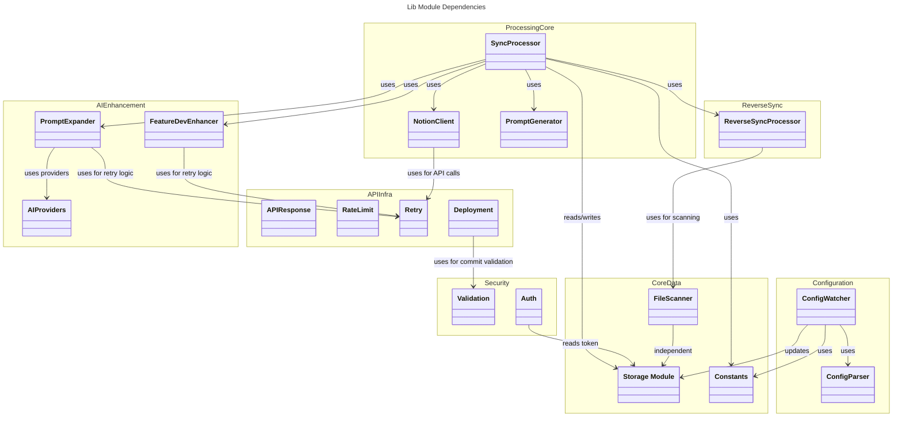
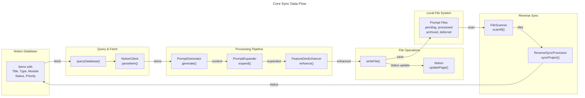

# C4 Code Level: lib/

## Overview
- **Name**: NSMA Core Library
- **Description**: Core library modules providing storage, Notion API integration, data processing, validation, authentication, rate limiting, deployment management, and AI-powered prompt enhancement
- **Location**: `/home/feyijimiohioma/projects/Nsma/lib/`
- **Language**: JavaScript (Node.js)
- **Purpose**: Foundation library for Notion Sync Manager Application (NSMA) - handles project configuration, data persistence, Notion synchronization, AI integration, and infrastructure utilities

## Code Elements

### Storage & Persistence

#### Module: `storage.js`
**Path**: `/home/feyijimiohioma/projects/Nsma/lib/storage.js`

Core data persistence module for projects, settings, and logs.

**Functions:**

- `ensureConfigDir(): Promise<void>` (line 7)
  - Ensures the configuration directory exists before any file operations
  - Creates directory recursively if missing
  - No parameters or return value

- `atomicWriteJSON(filepath: string, data: object): Promise<void>` (line 20)
  - Atomically writes JSON data to prevent corruption from interrupted writes
  - Writes to temp file first, then atomic rename
  - Parameters: filepath (target file), data (object to serialize)

- `resolvePromptsPath(promptsPath: string|null): string|null` (line 33)
  - Resolves project prompts path (handles absolute and relative paths)
  - Supports Docker deployment with relative path resolution
  - Parameters: promptsPath (path from project config)
  - Returns: Resolved absolute path or null

- `getProjectRoot(promptsPath: string|null): string|null` (line 52)
  - Gets project root directory from prompts path
  - Strips `/prompts` suffix if present
  - Parameters: promptsPath
  - Returns: Project root directory or null

- `getSettings(): Promise<object>` (line 66)
  - Retrieves application settings from file
  - Merges file settings with environment variable overrides
  - Returns: Settings object with notion token, API keys, preferences
  - Supports Docker environment variables: NOTION_TOKEN, NOTION_DATABASE_ID, REGISTRATION_TOKEN, ANTHROPIC_API_KEY

- `saveSettings(settings: object): Promise<object>` (line 94)
  - Persists settings to file with atomic write
  - Sets restrictive file permissions (0o600) for security
  - Parameters: settings object
  - Returns: Saved settings object

- `getProjects(): Promise<Array>` (line 111)
  - Retrieves all registered projects
  - Returns: Array of project objects

- `saveProjects(projects: Array): Promise<Array>` (line 121)
  - Atomically saves all projects
  - Parameters: projects array
  - Returns: Saved projects

- `getProject(id: string): Promise<object|null>` (line 127)
  - Retrieves a single project by ID
  - Parameters: project ID
  - Returns: Project object or null

- `createProject(project: object): Promise<object>` (line 132)
  - Creates a new project with auto-generated ID and timestamps
  - Generates ID using Date.now().toString(36) + random suffix
  - Initializes stats with zeros
  - Parameters: project data (name, slug, promptsPath, etc.)
  - Returns: Created project with ID and metadata

- `updateProject(id: string, updates: object): Promise<object>` (line 146)
  - Updates a project by ID with partial data
  - Parameters: project ID, updates object
  - Returns: Updated project object
  - Throws: Error if project not found

- `deleteProject(id: string): Promise<{success: boolean}>` (line 155)
  - Deletes a project by ID
  - Parameters: project ID
  - Returns: {success: true}

- `getLogs(limit: number = 100, level: string|null = null): Promise<Array>` (line 170)
  - Retrieves application logs with optional level filtering
  - Supports filtering by 'info', 'warn', 'error' levels
  - Parameters: limit (default 100), level filter (optional)
  - Returns: Array of log entries (last N entries)

- `addLog(entry: object): Promise<object>` (line 207)
  - Adds a structured log entry with automatic timestamp
  - Supports operation, projectId, projectName, itemId, message, details fields
  - Keeps last 1000 entries max
  - Parameters: log entry object
  - Returns: Log entry with timestamp

- `logInfo(entry: object): Promise<object>` (line 230)
  - Convenience function for info-level logging
  - Parameters: log entry without level
  - Returns: Log entry with level='info'

- `logWarn(entry: object): Promise<object>` (line 238)
  - Convenience function for warning-level logging
  - Parameters: log entry without level
  - Returns: Log entry with level='warn'

- `logError(entry: object, error: Error|null = null): Promise<object>` (line 248)
  - Convenience function for error-level logging
  - Extracts error details (message, code, status, stack)
  - Parameters: log entry, optional error object
  - Returns: Log entry with level='error' and details

- `getOrCreateInboxProject(): Promise<object>` (line 268)
  - Gets or creates the system Inbox project
  - Creates folder structure (pending, processed, archived, deferred)
  - Returns: Inbox project object with promptsPath

- `getAllProjectsWithInbox(): Promise<Array>` (line 291)
  - Gets all projects including the Inbox
  - Inbox is always first in array
  - Returns: [inbox, ...projects]

- `getInboxStats(): Promise<{pending: number, processed: number, archived: number, deferred: number}>` (line 300)
  - Gets count of items in each inbox folder
  - Parameters: none
  - Returns: Stats object with folder counts

- `getInboxItems(): Promise<Array>` (line 319)
  - Lists all inbox items with metadata
  - Parses YAML frontmatter from each item
  - Parameters: none
  - Returns: Array of inbox items with id, filename, title, type, priority, dates

- `moveInboxItemToProject(filename: string, projectId: string): Promise<object>` (line 378)
  - Moves an inbox item to a specific project
  - Updates frontmatter project reference
  - Parameters: filename, target projectId
  - Returns: {moved: true, from, to, project}
  - Throws: Error if project or item not found

- `countPrompts(promptsPath: string): Promise<{pending, processed, archived, deferred}>` (line 433)
  - Counts markdown files in each prompt subfolder
  - Live count from disk (not cached)
  - Parameters: path to prompts directory
  - Returns: Stats object with folder counts

- `refreshProjectStats(projectId: string): Promise<object|null>` (line 462)
  - Refreshes stats for a single project from disk
  - Updates project in storage
  - Parameters: project ID
  - Returns: New stats object or null if project not found

- `refreshAllProjectStats(): Promise<Array>` (line 476)
  - Refreshes stats for all projects
  - Parameters: none
  - Returns: Array of {id, name, stats} objects

---

### Notion Integration

#### Class: `NotionClient`
**Path**: `/home/feyijimiohioma/projects/Nsma/lib/notion.js`

Client for Notion API with automatic retry and rate limit handling.

**Constructor:**
- `NotionClient(token: string)` (line 4)
  - Initializes client with API token
  - Sets up authorization headers
  - Parameters: Notion API token

**Methods:**

- `request(method: string, endpoint: string, body: object|null = null): Promise<object>` (line 19)
  - Makes authenticated requests to Notion API
  - Implements automatic retry on 429 (rate limit), 5xx (server errors), network errors
  - Max 3 retries with exponential backoff (1s, 2s, 4s)
  - Parameters: HTTP method, API endpoint, optional request body
  - Returns: Parsed JSON response
  - Does NOT retry 4xx errors except 429

- `queryDatabase(databaseId: string, projectSlug: string|null = null, status: string = 'Not started'): Promise<Array>` (line 49)
  - Queries a Notion database with filtering and pagination
  - Filters by status and optional project slug
  - Handles Notion's max 100 results per request pagination
  - Parameters: databaseId, optional projectSlug filter, status filter
  - Returns: Array of all matching pages

- `getPageBlocks(pageId: string): Promise<Array>` (line 89)
  - Retrieves all blocks from a Notion page with pagination
  - Parameters: page ID
  - Returns: Array of block objects

- `updatePage(pageId: string, properties: object): Promise<object>` (line 110)
  - Updates page properties (status, fields, etc.)
  - Parameters: page ID, properties object
  - Returns: Updated page object

- `blocksToMarkdown(blocks: Array): string` (line 114)
  - Converts Notion blocks to Markdown format
  - Supports paragraph, headings, lists, code, quotes, callouts, etc.
  - Preserves text formatting (bold, italic, code, strikethrough)
  - Parameters: Array of block objects
  - Returns: Markdown string

- `extractRichText(richTextArray: Array): string` (line 143)
  - Extracts plain text and applies formatting from rich text objects
  - Parameters: Array of rich text items
  - Returns: Formatted markdown string

- `syncProjectOptionsToDatabase(databaseId: string, projectSlugs: Array): Promise<{added: Array, existing: Array}>` (line 161)
  - Syncs project slugs to Notion database's Project select property
  - Adds missing slugs to dropdown options
  - Filters out system slugs (starting with __)
  - Parameters: databaseId, array of project slugs
  - Returns: {added: new slugs, existing: all current options}

- `syncSelectOptionsToDatabase(databaseId: string, propertyName: string, optionNames: Array): Promise<{added: Array, existing: Array}>` (line 217)
  - Generic method to sync options to ANY select property
  - Used for modules, phases, etc.
  - Parameters: databaseId, property name, array of option names
  - Returns: {added: new options, existing: all current options}

- `updateItemProject(pageId: string, projectSlug: string): Promise<object>` (line 265)
  - Updates a single item's Project property
  - Parameters: page ID, project slug
  - Returns: Updated page object

- `listDatabases(): Promise<Array<{id, title}>>` (line 276)
  - Lists all databases the integration has access to
  - Uses Notion's search endpoint
  - Parameters: none
  - Returns: Array of {id, title} objects

- `findPageByTitle(title: string): Promise<object|null>` (line 296)
  - Finds a page by exact title match
  - Uses search endpoint
  - Parameters: page title to search for
  - Returns: Page object or null if not found

- `getDatabase(databaseId: string): Promise<object>` (line 318)
  - Gets database info including parent reference
  - Parameters: database ID
  - Returns: Database object with schema and metadata

- `createPage(parentPageId: string, title: string): Promise<object>` (line 328)
  - Creates a new page under a parent page
  - Parameters: parent page ID, page title
  - Returns: Created page object

- `createDatabasePage(databaseId: string, title: string): Promise<object>` (line 345)
  - Creates a new page as a database item
  - Parameters: database ID, page title
  - Returns: Created page object

- `clearPageContent(pageId: string): Promise<void>` (line 360)
  - Deletes all blocks from a page
  - Parameters: page ID
  - Returns: void

- `appendBlocks(pageId: string, blocks: Array): Promise<object>` (line 372)
  - Appends blocks to a page
  - Parameters: page ID, array of block objects
  - Returns: Updated page object

- `syncProjectSlugsPage(databaseId: string, projects: Array<{name, slug, modules}>, existingPageId: string|null = null): Promise<{pageId: string, created: boolean}>` (line 386)
  - Creates or updates "NSM Project Slugs" reference page
  - Builds table with project name → slug → modules mappings
  - Parameters: databaseId, projects array, optional existing page ID
  - Returns: {pageId, created: boolean}

- `static parseItem(page: object): object` (line 489)
  - Parses Notion page into structured item
  - Extracts title, type, module, status, priority, phase, description
  - Parameters: Notion page object
  - Returns: Parsed item object

---

### Data Processing & Generation

#### Class: `SyncProcessor`
**Path**: `/home/feyijimiohioma/projects/Nsma/lib/processor.js`

Orchestrates syncing items from Notion to local project prompts.

**Constructor:**
- `SyncProcessor(options: {dryRun?: boolean, verbose?: boolean, project?: string, skipReverseSync?: boolean})` (line 14)
  - Initializes processor with sync options
  - Parameters: optional configuration object

**Methods:**

- `log(message: string): void` (line 21)
  - Logs message to console
  - Parameters: message string

- `ensureDirectories(project: object): Promise<void>` (line 25)
  - Ensures prompt subdirectories exist (pending, processed, archived, deferred)
  - Parameters: project object
  - Creates directories or logs in dry-run mode

- `processProjectItems(project: object, items: Array, settings: object, notion: NotionClient, isInbox: boolean = false): Promise<{imported, updated, errors, skipped}>` (line 45)
  - Processes all items for a project
  - Handles AI expansion, feature-dev analysis, Notion updates
  - Performs reverse sync if enabled
  - Parameters: project, items array with {page, item}, settings, notion client, isInbox flag
  - Returns: Result object with counts
  - Updates project stats and creates log entries

- `run(): Promise<Array<{project, imported, updated, errors, reverseSync...}>>` (line 200)
  - Main entry point for sync process
  - Fetches unprocessed items from Notion
  - Groups items by project and routes unassigned to Inbox
  - Processes all projects in parallel
  - Performs reverse sync for all projects
  - Parameters: none
  - Returns: Array of result objects per project

---

#### Class: `PromptGenerator`
**Path**: `/home/feyijimiohioma/projects/Nsma/lib/prompt-generator.js`

Generates markdown prompt files from Notion items.

**Constructor:**
- `PromptGenerator(project: object, settings: object)` (line 2)

**Methods:**

- `determinePhase(item: object): string` (line 7)
  - Determines appropriate phase using module mapping or keywords
  - Parameters: Notion item
  - Returns: Phase name string

- `getRelatedFiles(moduleName: string): Array<string>` (line 29)
  - Gets file paths associated with a module
  - Parameters: module name
  - Returns: Array of file paths

- `estimateEffort(item: object): string` (line 34)
  - Estimates effort level based on type and description length
  - Types: Feature (3), Improvement (2), Bug Fix (1), Tech Debt (2), Research (2)
  - Adds 1 if description > 500 chars
  - Parameters: item object
  - Returns: Effort estimate string (XS/S/M/L)

- `identifyDependencies(item: object): Array<string>` (line 52)
  - Identifies service dependencies from item text
  - Recognizes payment, SMS, email, notification, reporting, auth, database, API keywords
  - Parameters: item object
  - Returns: Array of unique dependency names

- `generateFilename(item: object, phase: string): string` (line 74)
  - Generates sanitized filename for prompt file
  - Format: YYYYMMDD_phaseslug_itemtitle.md
  - Parameters: item, phase name
  - Returns: Filename string

- `generate(item: object, pageContent: string|null = null): {content, filename, phase, effort, dependencies}` (line 85)
  - Generates complete prompt file content
  - Includes YAML frontmatter with metadata
  - Includes objective, metadata, related files, dependencies, success criteria
  - Parameters: item, optional page content from Notion blocks
  - Returns: Object with markdown content, filename, and metadata

---

#### Class: `PromptExpander`
**Path**: `/home/feyijimiohioma/projects/Nsma/lib/prompt-expander.js`

Uses AI to expand brief item descriptions into detailed development prompts.

**Constructor:**
- `PromptExpander(settings: object)` (line 14)
  - Initializes with settings containing AI provider configs
  - Parameters: settings object

**Methods:**

- `expand(item: object, project: object): Promise<string>` (line 25)
  - Expands brief item description using configured AI providers
  - Tries providers in priority order with fallback
  - Parameters: Notion item, project with context
  - Returns: Expanded markdown content

- `tryProvider(provider: AIProvider, systemPrompt: string, userPrompt: string): Promise<string>` (line 65)
  - Attempts single provider with retry logic
  - Parameters: provider instance, prompts
  - Returns: Expanded content

- `buildDefaultSystemPrompt(project: object): string` (line 86)
  - Builds default system prompt with project context
  - Includes phases, modules, file paths
  - Parameters: project object
  - Returns: System prompt string

- `buildSystemPrompt(project: object): string` (line 134)
  - Builds final system prompt (default + custom)
  - Supports 'extend' (append custom) and 'replace' modes
  - Parameters: project object
  - Returns: System prompt string

- `buildUserPrompt(item: object): string` (line 161)
  - Builds user prompt with item details
  - Parameters: item object
  - Returns: User prompt string

- `buildFallbackContent(item: object): string` (line 178)
  - Builds fallback content if all AI providers fail
  - Parameters: item object
  - Returns: Markdown content

---

#### Class: `FeatureDevEnhancer`
**Path**: `/home/feyijimiohioma/projects/Nsma/lib/feature-dev-enhancer.js`

Enhances prompts with architecture analysis, code exploration, blueprints, and testing strategy.

**Constructor:**
- `FeatureDevEnhancer(settings: object)` (line 13)

**Methods:**

- `enhance(item: object, project: object, baseContent: string): Promise<string>` (line 50)
  - Enhances base prompt with feature-dev analysis sections
  - Calls Claude API with architecture and implementation guidance
  - Parameters: item, project, base content
  - Returns: Enhanced sections as markdown

- `isRetryable(error: Error): boolean` (line 23)
  - Determines if error should trigger retry

- `buildSystemPrompt(project: object): string` (line 84)
  - Builds system prompt for feature-dev analysis

- `buildFeatureDevPrompt(item: object, project: object, baseContent: string): string` (line 154)
  - Builds user prompt for feature-dev enhancement

- `formatEnhancedSections(aiResponse: string): string` (line 175)
  - Formats AI response as markdown sections

---

### Reverse Synchronization

#### Class: `ReverseSyncProcessor`
**Path**: `/home/feyijimiohioma/projects/Nsma/lib/reverse-sync.js`

Syncs local prompt folder locations back to Notion page statuses.

**Constants:**
- `FOLDER_STATUS_MAP` (line 7): Maps folders (pending, processed, archived, deferred) to Notion statuses
- `STATUS_FOLDER_MAP` (line 15): Reverse mapping for lookup

**Constructor:**
- `ReverseSyncProcessor(options: {notionClient, errorMode?, dryRun?, verbose?})` (line 29)

**Methods:**

- `syncProject(project: object): Promise<{updated, failed, skipped, errors, updatedItems}>` (line 50)
  - Syncs a single project to Notion
  - Scans all prompt folders and updates corresponding pages
  - Parameters: project object
  - Returns: Results with counts and error details

- `syncFile(file: object, folder: string, targetStatus: string, project: object): Promise<boolean>` (line 135)
  - Syncs single file to Notion
  - Updates page status and frontmatter
  - Parameters: file, folder, target status, project
  - Returns: true if updated, false if skipped

- `handleError(file: object, error: Error, project: object): Promise<void>` (line 163)
  - Handles sync errors based on error type
  - Stops on 401 (auth), continues on 429 (rate limit)
  - Applies errorMode for 404 and permission errors
  - Parameters: file, error, project

- `applyErrorMode(file: object, project: object, reason: string): Promise<void>` (line 205)
  - Applies configured error handling (skip/delete/archive)
  - Parameters: file, project, reason string

- `delay(ms: number): Promise<void>` (line 243)
  - Promise-based delay for rate limiting

- `syncAllProjects(projects: Array): Promise<Array>` (line 252)
  - Syncs multiple projects
  - Parameters: projects array
  - Returns: Array of results per project

**Function:**
- `runReverseSync(project: object, notionClient: NotionClient, options?: object): Promise<object>` (line 281)
  - Standalone function for reverse sync
  - Creates processor instance and runs sync
  - Parameters: project, notion client, optional options
  - Returns: Result object

---

### File Scanning & Frontmatter

#### Class: `FileScanner`
**Path**: `/home/feyijimiohioma/projects/Nsma/lib/file-scanner.js`

Scans prompt folders and parses YAML frontmatter.

**Constructor:**
- `FileScanner(promptsPath: string)` (line 13)

**Methods:**

- `scanAll(): Promise<{pending, processed, archived, deferred}>` (line 21)
  - Scans all standard prompt folders
  - Returns files grouped by folder
  - Returns: Object with folder -> files arrays

- `parseFile(filepath: string): Promise<{filepath, filename, notionPageId, notionUrl, lastSyncedToNotion, lastStatus, frontmatter}|null>` (line 71)
  - Parses single markdown file
  - Extracts frontmatter metadata
  - Parameters: file path
  - Returns: File data object or null if no notion_page_id

- `parseFrontmatter(content: string): object` (line 101)
  - Parses YAML frontmatter from markdown
  - Handles quoted values
  - Parameters: markdown content
  - Returns: Frontmatter key-value object

- `getFilesNeedingSync(): Promise<Array>` (line 138)
  - Gets files that need to be synced to Notion
  - Checks if never synced or folder changed
  - Returns: Array of files with needsSync flag and reason

- `getFileCounts(): Promise<{total, byFolder}>` (line 165)
  - Gets total and per-folder file counts
  - Returns: Counts object

**Function:**
- `updateFileFrontmatter(filepath: string, updates: object): Promise<void>` (line 186)
  - Updates YAML frontmatter in markdown file
  - Preserves file content
  - Parameters: file path, updates object
  - Returns: void

---

### Validation & Security

#### Module: `validation.js`
**Path**: `/home/feyijimiohioma/projects/Nsma/lib/validation.js`

Input validation and security checks.

**Constants:**
- `SLUG_REGEX` (line 6): `/^[a-z0-9-]+$/` - Slug format validation
- `COMMIT_HASH_REGEX` (line 9): `/^[a-f0-9]{7,40}$/i` - Git commit hash format
- `RESERVED_SLUGS` (line 12): ['__inbox__', 'inbox', 'settings', 'api', 'admin']

**Class: `ValidationError`**
- Extends Error with field property for error location

**Functions:**

- `validateProjectRegistration(data: object): Promise<boolean>` (line 26)
  - Validates project registration data
  - Checks required fields, slug format, path validity, path traversal
  - Auto-corrects prompts path suffix
  - Parameters: project data object
  - Returns: true if valid
  - Throws: ValidationError if invalid

- `validatePromptsPath(path: string): {valid, corrected, path, warning?}` (line 116)
  - Validates and optionally corrects prompts path
  - Ensures path ends with /prompts
  - Parameters: path string
  - Returns: Validation result object

- `findProjectBySlug(slug: string): Promise<object|null>` (line 148)
  - Checks if slug already in use
  - Parameters: slug string
  - Returns: Existing project or null

- `containsPathTraversal(path: string): boolean` (line 160)
  - Detects path traversal attempts (..)
  - Checks original, normalized, and decoded forms
  - Parameters: path string
  - Returns: boolean

- `isValidCommitHash(hash: string): boolean` (line 184)
  - Validates git commit hash format
  - Parameters: commit hash string
  - Returns: boolean

- `validateQueryLimit(value: string|null, defaultValue: number = 50, min: number = 1, max: number = 500): number` (line 198)
  - Validates and bounds numeric query parameter
  - Parameters: value, default, min, max
  - Returns: Validated and bounded number

---

#### Module: `auth.js`
**Path**: `/home/feyijimiohioma/projects/Nsma/lib/auth.js`

Authentication and authorization for API endpoints.

**Functions:**

- `timingSafeCompare(a: string, b: string): boolean` (line 10)
  - Timing-safe string comparison to prevent timing attacks
  - Parameters: two strings to compare
  - Returns: boolean

- `verifyRegistrationToken(request: Request): Promise<boolean>` (line 30)
  - Verifies Bearer token from Authorization header
  - Uses timing-safe comparison
  - Parameters: request object with headers
  - Returns: true if valid
  - Throws: Error if invalid

- `withAuth(handler: Function): Function` (line 78)
  - Higher-order function to wrap API handlers with auth
  - Parameters: async handler function
  - Returns: Wrapped handler that checks auth first
  - Returns 401 response if auth fails

- `validateRequest(request: Request): Promise<{valid: boolean, error?: string}>` (line 105)
  - Validates request authentication (compatibility wrapper)
  - Parameters: request object
  - Returns: {valid: boolean, error?: message}

---

### Rate Limiting

#### Module: `rate-limit.js`
**Path**: `/home/feyijimiohioma/projects/Nsma/lib/rate-limit.js`

Simple in-memory rate limiting for API endpoints.

**Configuration:**
- `WINDOW_MS` (line 12): Rate limit window in ms (default 60000)
- `MAX_REQUESTS` (line 13): Max requests per window (default 100)
- `CLEANUP_INTERVAL` (line 20): Cleanup interval (5 minutes)

**Functions:**

- `checkRateLimit(ip: string): {allowed, remaining, resetAt}` (line 51)
  - Checks if request from IP should be rate limited
  - Tracks counts per IP with sliding window
  - Parameters: client IP address
  - Returns: {allowed: boolean, remaining: number, resetAt: number}

- `getRateLimitConfig(): {windowMs, maxRequests}` (line 80)
  - Gets current rate limit configuration
  - Returns: Config object

- `clearRateLimitForIp(ip: string): void` (line 91)
  - Clears rate limit data for IP (testing)
  - Parameters: IP address

- `getRateLimitStats(): {trackedIps, config}` (line 99)
  - Gets current stats
  - Returns: Stats object with tracked IPs count

---

### API Responses & Error Handling

#### Module: `api-response.js`
**Path**: `/home/feyijimiohioma/projects/Nsma/lib/api-response.js`

Standardized API response formatting with caching headers.

**Constants:**
- `CACHE_DURATIONS` (line 7): Cache times for different endpoint types
  - status: 5s
  - inbox: 10s
  - projects: 30s
  - logs: 30s
  - analytics: 30s
  - settings: 60s

**Functions:**

- `jsonWithCache(data: object, options?: {maxAge?: number, status?: number}): NextResponse` (line 25)
  - Creates JSON response with Cache-Control headers
  - Uses 'private' directive for browser caching only
  - Parameters: data object, optional {maxAge, status}
  - Returns: NextResponse object

- `sanitizeError(error: Error|string): string` (line 59)
  - Sanitizes error for client response
  - Prevents leaking internal details
  - Safe patterns: not found, invalid, unauthorized, validation, missing, required, etc.
  - Parameters: error object or string
  - Returns: Safe error message for client

- `jsonError(error: Error|string, status?: number): NextResponse` (line 87)
  - Creates error response (never cached)
  - Automatically sanitizes messages
  - Parameters: error, optional HTTP status (default 500)
  - Returns: NextResponse with error message

---

### Retry & Network Handling

#### Module: `retry.js`
**Path**: `/home/feyijimiohioma/projects/Nsma/lib/retry.js`

Retry utility with exponential backoff for API calls.

**Functions:**

- `defaultIsRetryable(error: Error): boolean` (line 11)
  - Determines if error should trigger retry
  - Retries: network errors, 429, 5xx
  - Parameters: error object
  - Returns: boolean

- `extractRetryAfter(error: Error): number|null` (line 41)
  - Extracts Retry-After delay from error
  - Checks error object and message
  - Parameters: error object
  - Returns: Delay in ms or null

- `calculateBackoff(attempt: number, baseDelay: number, maxDelay: number): number` (line 65)
  - Calculates delay with exponential backoff and jitter
  - Formula: baseDelay * 2^(attempt-1) + jitter
  - Parameters: attempt number, baseDelay (default 1000), maxDelay (default 30000)
  - Returns: Delay in ms

- `withRetry(fn: Function, options?: {maxRetries?, baseDelay?, maxDelay?, isRetryable?, onRetry?}): Promise<any>` (line 89)
  - Executes function with retry logic
  - Default: 3 retries, 1s base, 30s max
  - Parameters: async function, optional options
  - Returns: Function result
  - Throws: Last error if all retries fail

- `fetchWithRetryInfo(url: string, options?: object): Promise<Response>` (line 140)
  - Enhanced fetch wrapper that captures retry info
  - Adds status, statusCode, body, retryAfter to errors
  - Parameters: URL, fetch options
  - Returns: Response object
  - Throws: Error with retry properties

---

### Deployment & Configuration

#### Module: `deployment.js`
**Path**: `/home/feyijimiohioma/projects/Nsma/lib/deployment.js`

Deployment utilities for version management and updates.

**Constants:**
- `COMMAND_TIMEOUT` (line 10): 5 minute timeout for long commands

**Functions:**

- `getCurrentVersion(): Promise<string>` (line 16)
  - Gets current version from package.json
  - Returns: Version string or '0.0.0'

- `getCurrentCommit(): Promise<string>` (line 31)
  - Gets current short git commit hash
  - Returns: Commit hash or 'unknown'

- `getCurrentCommitFull(): Promise<string>` (line 47)
  - Gets full current git commit hash
  - Returns: Full commit hash or empty string

- `checkForUpdates(): Promise<{hasUpdates, currentCommit, latestCommit, commitCount, commits}>` (line 63)
  - Checks for updates from git remote
  - Fetches origin/master and compares
  - Parameters: none
  - Returns: Update info object

- `rollbackUpdate(commitHash: string): Promise<{success, error?}>` (line 139)
  - Rollbacks to specific commit using git reset
  - Validates commit hash format to prevent injection
  - Parameters: commit hash
  - Returns: {success: boolean, error?: string}

- `executeUpdate(onProgress?: Function): Promise<{success, steps, error?, rolledBack?}>` (line 165)
  - Executes update process with auto-rollback
  - Steps: git pull -> npm install -> npm build
  - Auto-rolls back on failure
  - Parameters: optional progress callback
  - Returns: Result object with step details

- `restartServices(): Promise<{success, error?}>` (line 231)
  - Restarts systemd services via systemctl
  - Restarts daemon then web service
  - Returns: {success: boolean}

- `scheduleServiceRestart(delayMs: number = 1000): void` (line 253)
  - Schedules delayed service restart
  - Allows response to be sent before restart
  - Parameters: delay in ms

- `getInstanceInfo(): Promise<{instance, nodeEnv, port, installDir, configDir}>` (line 270)
  - Gets deployment instance information
  - Returns: Instance info object

- `isProductionInstance(): boolean` (line 284)
  - Checks if running in production
  - Returns: boolean

---

#### Module: `constants.js`
**Path**: `/home/feyijimiohioma/projects/Nsma/lib/constants.js`

Application constants and default configurations.

**Configuration:**
- `CONFIG_DIR` (line 4): User config directory (~/.notion-sync-manager)
- `PROJECTS_BASE_PATH` (line 8): Base path for projects (Docker support)
- `PROJECTS_FILE` (line 10): Projects data file path
- `SETTINGS_FILE` (line 11): Settings file path
- `LOGS_FILE` (line 12): Logs file path

**DEFAULT_SETTINGS** (line 14): Default application settings including:
- API tokens for Notion and Anthropic
- Feature flags (featureDevEnabled)
- AI provider priority
- Sync interval (15 minutes)
- Success criteria template

**DEFAULT_PROJECT** (line 31): Default project structure with:
- Metadata (id, name, slug, timestamps)
- Folder stats (pending, processed, archived, deferred)
- Sync metadata (lastSync, lastReverseSync)
- Configuration (phases, modules, modulePhaseMapping)
- AI prompt configuration

**Constants:**
- `EFFORT_ESTIMATES` (line 59): XS, S, M, L, XL effort levels
- `ITEM_TYPES` (line 67): Feature, Bug Fix, Improvement, etc.
- `ALWAYS_EXECUTE_TYPES` (line 78): Bug Fix, Documentation, Security Fix, Tech Debt
- `INBOX_PROJECT_ID` (line 86): '__inbox__'
- `INBOX_PATH` (line 87): Config directory + 'inbox'
- `INBOX_PROJECT` (line 89): Inbox project definition

---

### Configuration Watching & Parsing

#### Class: `ConfigWatcher`
**Path**: `/home/feyijimiohioma/projects/Nsma/lib/config-watcher.js`

Monitors project documentation files and refreshes configuration.

**Constructor:**
- `ConfigWatcher(options?: {debounceMs?, statsDebounceMs?, verbose?, onStatsChange?})` (line 13)

**Methods:**

- `getProjectRoot(project: object): string|null` (line 33)
  - Gets project root from promptsPath
  - Strips /prompts suffix if present
  - Parameters: project object
  - Returns: Project root path or null

- `getWatchPaths(project: object): Promise<Array<string>>` (line 48)
  - Gets configuration file paths to watch
  - Parameters: project object
  - Returns: Array of file paths

- `watchProject(project: object): Promise<void>` (line 62)
  - Starts watching a project's config files
  - Uses chokidar for file monitoring
  - Debounces refresh on changes
  - Parameters: project object

- `unwatchProject(projectId: string): Promise<void>` (line 99)
  - Stops watching a project
  - Cleans up watchers and timers
  - Parameters: project ID

- `watchProjectPrompts(project: object): Promise<void>` (line 131)
  - Starts watching project's prompts directories
  - Monitors .md file additions and deletions
  - Debounces stats refresh
  - Parameters: project object

- `debouncedStatsRefresh(project: object): void` (line 175)
  - Debounced stats refresh handler
  - Parameters: project object

- `refreshStats(project: object): Promise<{success, stats?, error?}>` (line 192)
  - Refreshes stats for single project from disk
  - Calls stats change callback
  - Parameters: project object
  - Returns: Result object

- `unwatchAll(): Promise<void>` (line 214)
  - Stops all watchers
  - Parameters: none

- `debouncedRefresh(project: object): void` (line 223)
  - Debounced config refresh handler
  - Parameters: project object

- `hasConfigChanged(project: object): Promise<boolean>` (line 241)
  - Checks if config files have changed
  - Uses file modification times
  - Parameters: project object
  - Returns: boolean

- `getConfigMtimes(project: object): Promise<object>` (line 276)
  - Gets modification times for all config files
  - Parameters: project object
  - Returns: {filepath: mtimeMs} object

- `refreshConfig(project: object): Promise<{success, changes?, error?}>` (line 307)
  - Refreshes config for single project
  - Parses config files and updates project
  - Parameters: project object
  - Returns: Result with change details

- `refreshAllConfigs(): Promise<{checked, refreshed}>` (line 367)
  - Refreshes configs for all active projects
  - Only refreshes if changes detected
  - Parameters: none
  - Returns: {checked: total, refreshed: count}

- `watchAllProjects(): Promise<void>` (line 396)
  - Starts watching all active projects
  - Parameters: none

---

#### Class: `ConfigParser`
**Path**: `/home/feyijimiohioma/projects/Nsma/lib/config-parser.js`

Parses project configuration from markdown documentation files.

**Constructor:**
- `ConfigParser(projectPath: string)` (line 10)
  - Supported files: .nsma-config.md, PERSPECTIVE.md, ARCHITECTURE.md, etc.
  - Doc folders: architecture, setup, security, api

**Methods:**

- `findConfigFiles(): Promise<Array<{filename, filepath}>>` (line 28)
  - Finds all configuration files in project
  - Scans root and docs/ subfolders
  - Returns: Array of found files

- `scanDocsFolder(): Promise<Array<{filename, filepath}>>` (line 50)
  - Scans docs/ subfolders for markdown files
  - Returns: Array of doc files

- `parseConfigFile(filepath: string): Promise<{frontmatter, phases, modules, modulePhaseMapping, sourceFile}>` (line 90)
  - Parses single config file
  - Parameters: file path
  - Returns: Parsed configuration object

- `parseFrontmatter(content: string): object` (line 115)
  - Parses YAML frontmatter from markdown
  - Handles quoted values
  - Parameters: file content
  - Returns: Frontmatter key-value object

- `parsePhases(content: string): Array<{id, name, description, keywords, priority}>` (line 139)
  - Parses phases from markdown sections
  - Looks for "Development Phases" section
  - Extracts ID, description, keywords, priority
  - Parameters: file content
  - Returns: Array of phase objects (sorted by priority)

- `parseModules(content: string): Array<{id, name, filePaths, phase}>` (line 182)
  - Parses modules from markdown sections
  - Looks for "Modules" section
  - Extracts ID, description, file paths, phase
  - Parameters: file content
  - Returns: Array of module objects

- `generateMapping(modules: Array, phases: Array): object` (line 234)
  - Generates module-phase mapping
  - Parameters: modules array, phases array
  - Returns: {moduleId: phaseId} object

- `generateId(name: string): string` (line 260)
  - Generates stable ID from name
  - Converts to lowercase, replaces non-alphanumeric with hyphens
  - Parameters: name string
  - Returns: Generated ID

- `mergeWithExisting(parsedConfig: object, existingProject: object): object` (line 275)
  - Merges parsed config with existing project
  - Preserves existing IDs
  - Parameters: parsed config, existing project
  - Returns: Merged configuration

- `mergePhases(newPhases: Array, existingPhases: Array): Array` (line 297)
  - Merges phases preserving IDs
  - Parameters: new phases, existing phases
  - Returns: Merged phases array

- `mergeModules(newModules: Array, existingModules: Array): Array` (line 327)
  - Merges modules preserving IDs
  - Parameters: new modules, existing modules
  - Returns: Merged modules array

- `regenerateMapping(modules: Array, phases: Array, originalMapping: object): object` (line 355)
  - Regenerates mapping after merge
  - Parameters: modules, phases, original mapping
  - Returns: New mapping object

- `parseMultipleFiles(configFiles: Array): Promise<object>` (line 378)
  - Parses and merges multiple config files
  - Skips unparseable files
  - Parameters: array of {filename, filepath} objects
  - Returns: Merged configuration

- `mergeConfigs(configs: Array): object` (line 411)
  - Merges configurations from multiple files
  - Deduplicates phases and modules by name
  - Merges file paths and keywords
  - Parameters: array of parsed configs
  - Returns: Merged configuration

- `autoImport(existingProject?: object): Promise<object>` (line 471)
  - Main entry point for config import
  - Finds all config files and merges them
  - Merges with existing project if provided
  - Parameters: optional existing project
  - Returns: Imported configuration with metadata

---

### AI Provider Integration

#### Module: `ai-providers.js`
**Path**: `/home/feyijimiohioma/projects/Nsma/lib/ai-providers.js`

Abstraction layer for multiple AI providers (Claude, Gemini).

**Base Class: `AIProvider`**
- Abstract base class defining provider interface
- Methods: isConfigured(), expand(), isRetryable()

**Class: `AnthropicProvider extends AIProvider`**
- Uses Claude Sonnet 4 model
- `isConfigured(settings): boolean`
- `expand(systemPrompt, userPrompt): Promise<string>`
- `isRetryable(error): boolean` - Retries on 5xx, 529, rate limit

**Class: `GeminiProvider extends AIProvider`**
- Uses Gemini 1.5 Pro model
- Max output tokens: 2000, temperature: 0.7
- `isConfigured(settings): boolean`
- `expand(systemPrompt, userPrompt): Promise<string>`
- `isRetryable(error): boolean` - Retries on 5xx, 429, quota exceeded

**Provider Registry:**
- Maps provider names to classes and API key fields
- Supports 'anthropic' and 'gemini'

**Functions:**

- `getConfiguredProviders(settings: object): Array<AIProvider>` (line 171)
  - Gets configured providers in priority order
  - Parameters: settings with API keys and priority
  - Returns: Array of provider instances

- `getProviderMetadata(settings: object): Array<{id, name, configured}>` (line 195)
  - Gets provider metadata for UI display
  - Parameters: settings object
  - Returns: Array of provider metadata

- `getAllProviderIds(): Array<string>` (line 214)
  - Gets all available provider IDs
  - Returns: Array of provider IDs

---

## Dependencies

### Internal Dependencies (Other Lib Modules)

**Storage System:**
- `storage.js` - Data persistence
- `constants.js` - Configuration constants

**Data Processing:**
- `processor.js` - Main sync orchestration
  - Uses: `NotionClient`, `PromptGenerator`, `PromptExpander`, `FeatureDevEnhancer`, `ReverseSyncProcessor`, `storage`, `constants`
- `prompt-generator.js` - Prompt file generation
- `prompt-expander.js` - AI prompt expansion
  - Uses: `ai-providers.js`, `retry.js`
- `feature-dev-enhancer.js` - AI feature analysis
  - Uses: `retry.js`
- `reverse-sync.js` - File-to-Notion sync
  - Uses: `file-scanner.js`

**Validation & Security:**
- `validation.js` - Input validation
- `auth.js` - Authentication
  - Uses: `storage.js`

**File Operations:**
- `file-scanner.js` - Prompt file scanning
  - Uses: fs/promises, path

**Configuration:**
- `config-watcher.js` - Config file monitoring
  - Uses: `config-parser.js`, `storage.js`, `constants.js`
- `config-parser.js` - Markdown config parsing

**API & Infrastructure:**
- `api-response.js` - Response formatting
- `rate-limit.js` - Request rate limiting
- `retry.js` - Network retry logic
- `deployment.js` - Deployment utilities
  - Uses: `validation.js`

**AI Integration:**
- `ai-providers.js` - AI provider abstraction
  - Uses: `@anthropic-ai/sdk`, `@google/generative-ai`

**Notion Integration:**
- `notion.js` - Notion API client
  - Uses: `retry.js`

---

### External Dependencies

**NPM Packages:**
- `@anthropic-ai/sdk` - Claude API client
- `@google/generative-ai` - Gemini API client
- `chokidar` - File system monitoring
- `next/server` - Next.js API utilities (NextResponse)

**Node.js Built-ins:**
- `fs/promises` - Async file operations (readFile, writeFile, mkdir, readdir, unlink, rename, chmod, stat)
- `fs` - Sync file operations (existsSync)
- `path` - Path operations (join, isAbsolute, dirname, basename, normalize, resolve)
- `child_process` - Command execution (execFile)
- `util` - Utilities (promisify)
- `os` - OS utilities (homedir)
- `crypto` - Cryptographic utilities (timingSafeEqual)

---

## Relationships

### Module Dependency Graph

### Data Flow

### Key Interactions

1. **Sync Flow** (processor.js orchestrates):
   - Query Notion database → Parse items → Generate prompts → AI enhance → Write files → Update Notion status

2. **Reverse Sync Flow** (ReverseSyncProcessor):
   - Scan prompt folder structure → Compare with Notion status → Update Notion if changed

3. **AI Enhancement Flow** (PromptExpander + FeatureDevEnhancer):
   - Get configured providers → Try primary → Fall back on failure → Return expanded content

4. **Configuration Watching** (ConfigWatcher + ConfigParser):
   - Watch project files → Parse on change → Merge configs → Update project

5. **Authentication** (withAuth middleware):
   - Check Authorization header → Timing-safe comparison → Allow/Deny request

---

## Architecture Patterns

### Modular Design
- Each module has single responsibility
- Clear interfaces between modules
- Dependency injection for testability

### Error Handling
- Retry logic with exponential backoff for network failures
- Timing-safe comparisons for security
- Sanitized error messages for API clients
- Detailed internal error logging

### File Operations
- Atomic writes with temp files to prevent corruption
- Debounced file watching to handle rapid changes
- YAML frontmatter parsing for metadata

### AI Integration
- Provider abstraction for multiple AI services
- Fallback strategy when provider fails
- Structured prompts with project context
- Custom prompt support per project

### Rate Limiting & Throttling
- In-memory rate limiter for API endpoints
- Request delay between Notion API calls (350ms)
- Debounced config refresh to handle rapid changes

### Configuration Management
- Support for multiple config file formats
- Intelligent merging of configs from multiple sources
- File modification time tracking for change detection
- Environment variable overrides for Docker

---

## Notes

- All database and file operations are asynchronous
- Configuration is automatically discovered from project documentation
- AI enhancement is optional and gracefully degrades if providers fail
- Reverse sync has configurable error handling modes (skip/delete/archive)
- Rate limiting and retry logic are built into core modules for reliability
- Security considerations: timing-safe comparisons, path traversal detection, error message sanitization
