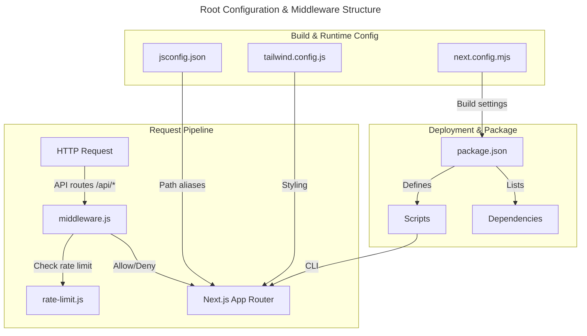
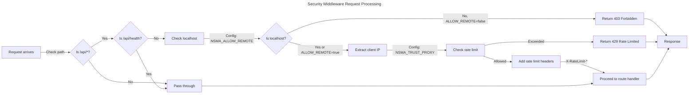

# C4 Code Level: Root Configuration & Middleware

## Overview
- **Name**: Root Configuration & Middleware
- **Description**: Application-wide configuration, middleware setup, and foundational Next.js framework configuration that manages security, performance, and build optimization for the NSMA Notion Sync Manager application.
- **Location**: `/home/feyijimiohioma/projects/Nsma/` (root directory)
- **Language**: JavaScript (ES modules), JSX, TypeScript configuration
- **Purpose**: Provides foundational configuration for the Next.js application including security middleware for rate limiting and localhost restrictions, build optimization settings, styling configuration through Tailwind CSS, and npm package management.

## Code Elements

### Middleware Functions

#### `middleware(request: Request): NextResponse`
- **Description**: Security middleware that provides multi-layered API protection. Applies to all `/api/*` routes and implements localhost restrictions, rate limiting, and proxy header validation.
- **Location**: `/home/feyijimiohioma/projects/Nsma/middleware.js:18-94`
- **Type**: Middleware function (Next.js edge function)
- **Parameters**:
  - `request: Request` - Incoming HTTP request object
- **Return Type**: `NextResponse` - Next.js response object with security checks applied or allowed to proceed
- **Responsibilities**:
  1. Skip non-API routes (pass through to application)
  2. Skip health check endpoint (`/api/health`) for Docker/Kubernetes readiness probes
  3. Check localhost restriction based on `NSMA_ALLOW_REMOTE` environment variable
  4. Validate X-Forwarded-For header when `NSMA_TRUST_PROXY` is enabled
  5. Apply rate limiting via `checkRateLimit()` function
  6. Return 403 (Forbidden) for non-localhost access when remote access is disabled
  7. Return 429 (Too Many Requests) when rate limit is exceeded
  8. Add rate limit response headers to allowed requests
- **Configuration Environment Variables**:
  - `NSMA_ALLOW_REMOTE=true` - Allow non-localhost access (for Docker deployments)
  - `NSMA_TRUST_PROXY=true` - Trust X-Forwarded-For header (when behind proxy)
  - `NSMA_RATE_LIMIT_MAX=100` - Max requests per window (default from `rate-limit.js`)
  - `NSMA_RATE_LIMIT_WINDOW_MS=60000` - Window duration in milliseconds
- **Security Considerations**:
  - Prevents header spoofing by requiring explicit proxy trust configuration
  - Checks multiple localhost patterns: `localhost`, `127.0.0.1`, `[::1]`, `0.0.0.0`
  - Only trusts X-Forwarded-For when explicitly enabled
  - Logs security events to console for audit trails
- **Dependencies**:
  - `./lib/rate-limit.js` - `checkRateLimit()` function
  - `next/server` - `NextResponse` class
  - `getClientIp()` helper function (internal)

#### `getClientIp(request: Request, trustProxy: boolean): string`
- **Description**: Extracts client IP address from request, respecting proxy header configuration. Used by middleware for rate limiting and security checks.
- **Location**: `/home/feyijimiohioma/projects/Nsma/middleware.js:102-117`
- **Type**: Helper function
- **Parameters**:
  - `request: Request` - The incoming HTTP request
  - `trustProxy: boolean` - Whether to trust proxy headers (X-Forwarded-For, X-Real-IP)
- **Return Type**: `string` - Client IP address in dotted decimal notation
- **Logic Flow**:
  1. If `trustProxy` is true, check for `x-forwarded-for` header (comma-separated, take first)
  2. If not found, check for `x-real-ip` header
  3. Default to `127.0.0.1` for direct connections
- **Dependencies**: None (pure utility function)

#### `config` (Middleware Configuration)
- **Description**: Next.js middleware configuration object specifying which routes trigger the middleware
- **Location**: `/home/feyijimiohioma/projects/Nsma/middleware.js:119-121`
- **Type**: Configuration export
- **Configuration**:
  - `matcher: '/api/:path*'` - Apply middleware to all API routes (recursive)

### Next.js Configuration Functions

#### `headers()` (Async Configuration Function)
- **Description**: Async function that returns security headers to be applied to all HTTP responses. Configured in `next.config.mjs` to add security best practices headers.
- **Location**: `/home/feyijimiohioma/projects/Nsma/next.config.mjs:17-35`
- **Type**: Next.js headers configuration function
- **Returns**: Array of header configuration objects with source matching pattern and header values
- **Security Headers Applied**:
  - `X-Content-Type-Options: nosniff` - Prevent MIME type sniffing attacks
  - `X-Frame-Options: DENY` - Prevent clickjacking/framing attacks
  - `X-XSS-Protection: 1; mode=block` - Enable XSS protection in legacy browsers
  - `Referrer-Policy: strict-origin-when-cross-origin` - Control referrer information leakage
  - `Permissions-Policy: camera=(), microphone=(), geolocation=()` - Disable unnecessary browser features
- **Pattern**: Applied to `/:path*` (all routes)

### Configuration Objects

#### `nextConfig` (Next.js Configuration)
- **Description**: Main Next.js framework configuration object. Defines build output strategy, React settings, experimental features, and security headers.
- **Location**: `/home/feyijimiohioma/projects/Nsma/next.config.mjs:2-36`
- **Type**: Configuration object
- **Key Settings**:

| Setting | Value | Purpose |
|---------|-------|---------|
| `reactStrictMode` | `true` | Enable React strict mode for development warnings |
| `output` | `'standalone'` | Enable standalone mode for Docker (reduces image by 80%) |
| `experimental.serverActions.allowedOrigins` | From `ALLOWED_ORIGINS` env or `localhost:PORT` | Whitelist origins for Server Actions |
| `PORT` | Default 3100 | Dynamic port selection (3100 dev, 5100 prod) |

#### `tailwindConfig` (Tailwind CSS Configuration)
- **Description**: Tailwind CSS styling configuration with custom color palette and typography settings. Extends default theme with dark mode colors and custom fonts.
- **Location**: `/home/feyijimiohioma/projects/Nsma/tailwind.config.js:2-36`
- **Type**: Tailwind CSS configuration object
- **Content Paths**:
  - `./app/**/*.{js,ts,jsx,tsx,mdx}` - App directory files
  - `./components/**/*.{js,ts,jsx,tsx,mdx}` - Component files
- **Custom Color Extensions**:
  - **Dark palette** (10 shades): From light `#f7f7f8` to darkest `#0a0a0f`
    - Typical usage: `bg-dark-800`, `text-dark-50`
  - **Accent palette** (3 variants): Indigo-based (`#6366f1`)
    - `accent-DEFAULT`: `#6366f1` (primary)
    - `accent-light`: `#818cf8` (lighter variant)
    - `accent-dark`: `#4f46e5` (darker variant)
- **Font Family Extensions**:
  - `font-sans`: Outfit, fallback to system UI
  - `font-mono`: JetBrains Mono with monospace fallback
- **Plugins**: None (no third-party Tailwind plugins)

#### `jsConfig` (JavaScript/TypeScript Path Configuration)
- **Description**: JavaScript module path configuration for absolute imports and TypeScript support. Simplifies import statements across the application.
- **Location**: `/home/feyijimiohioma/projects/Nsma/jsconfig.json:1-8`
- **Type**: JavaScript/TypeScript compiler configuration
- **Path Aliases**:
  - `@/*` maps to `./*` (root directory)
  - **Usage**: Allows `import { Component } from '@/components/Button'` instead of relative paths

### NPM Package Configuration

#### Scripts
- **Description**: Command-line scripts configured in package.json for development, build, testing, and synchronization tasks.
- **Location**: `/home/feyijimiohioma/projects/Nsma/package.json:6-21`

| Script | Command | Purpose |
|--------|---------|---------|
| `dev` | `next dev -p ${PORT:-3100} --turbopack` | Start development server on port 3100 (or env PORT), with Turbopack bundler |
| `build` | `next build` | Production build optimization |
| `start` | `next start -p ${PORT:-3100}` | Start production server |
| `sync` | `node cli/index.js` | Run full sync operation (forward and reverse) |
| `sync:dry` | `node cli/index.js --dry-run` | Run sync in dry-run mode (no changes) |
| `sync:daemon` | `node cli/index.js --daemon` | Run sync as daemon process |
| `sync:forward` | `node cli/index.js --skip-reverse-sync` | Run only forward sync (skip reverse) |
| `reverse-sync` | `node cli/index.js reverse-sync` | Run only reverse sync (Notion to local) |
| `reverse-sync:dry` | `node cli/index.js reverse-sync --dry-run` | Dry-run reverse sync |
| `lint` | `next lint` | Run ESLint on codebase |
| `test` | `vitest` | Run test suite with Vitest |
| `test:ui` | `vitest --ui` | Run tests with interactive UI |
| `test:coverage` | `vitest --coverage` | Generate code coverage report |
| `test:watch` | `vitest --watch` | Run tests in watch mode |

#### Binary Configuration
- **Description**: CLI command registration for npm global installation
- **Location**: `/home/feyijimiohioma/projects/Nsma/package.json:22-24`
- **Binary**: `notion-sync` -> `./cli/index.js`
- **Purpose**: Allows running `notion-sync` command globally after npm install -g

#### Node.js Engine Requirement
- **Requirement**: Node.js >= 18.0.0
- **Location**: `/home/feyijimiohioma/projects/Nsma/package.json:54-56`

## Dependencies

### Production Dependencies

| Package | Version | Purpose |
|---------|---------|---------|
| `@anthropic-ai/sdk` | `^0.71.2` | Anthropic Claude API client for AI-powered features |
| `@google/generative-ai` | `^0.24.1` | Google Generative AI API client (Gemini) |
| `chokidar` | `^5.0.0` | File system watcher for monitoring file changes (sync triggers) |
| `lucide-react` | `^0.562.0` | Icon library with React components |
| `next` | `^16.1.1` | Next.js framework (React metaframework for SSR/SSG) |
| `react` | `^19.2.3` | React UI library (core dependency) |
| `react-dom` | `^19.2.3` | React DOM rendering library |
| `recharts` | `^3.6.0` | React charting library for data visualization (sync status dashboard) |

### Development Dependencies

| Package | Version | Purpose |
|---------|---------|---------|
| `@testing-library/jest-dom` | `^6.9.1` | Custom Jest matchers for DOM testing |
| `@testing-library/react` | `^16.3.1` | React Testing Library utilities |
| `@testing-library/user-event` | `^14.6.1` | User event simulation for tests |
| `@types/node` | `^25.0.3` | TypeScript types for Node.js |
| `@types/react` | `^19.2.7` | TypeScript types for React |
| `@types/react-dom` | `^19.2.3` | TypeScript types for React DOM |
| `@vitejs/plugin-react` | `^5.1.2` | Vite plugin for React support in tests |
| `@vitest/coverage-v8` | `^4.0.16` | Code coverage reporting (V8 backend) |
| `@vitest/ui` | `^4.0.16` | Interactive UI for Vitest test runner |
| `autoprefixer` | `^10.4.16` | PostCSS plugin for vendor prefixes |
| `eslint` | `^8.0.0` | JavaScript linter |
| `eslint-config-next` | `^14.0.0` | Next.js ESLint configuration preset |
| `happy-dom` | `^20.0.11` | Lightweight DOM implementation for testing |
| `postcss` | `^8.4.31` | CSS post-processor (for Tailwind) |
| `tailwindcss` | `^3.3.5` | Utility-first CSS framework |
| `typescript` | `^5.9.3` | TypeScript compiler and language support |
| `vitest` | `^4.0.16` | Fast unit test framework (Vite-native) |

## Internal Dependencies

### Middleware Dependencies
- `./lib/rate-limit.js` - Rate limiting module providing `checkRateLimit()` function
- `next/server` - Next.js server utilities (`NextResponse`)

### Configuration Dependencies
- `./app/**/*.{js,ts,jsx,tsx,mdx}` - App directory component files
- `./components/**/*.{js,ts,jsx,tsx,mdx}` - Reusable component files
- `./cli/index.js` - CLI entry point for sync operations

## Relationships

### Configuration & Feature Integration



### Security Middleware Flow



### Tailwind Color System

```mermaid
---
title: Tailwind Custom Color Palette
---
classDiagram
    class DarkColorPalette {
        50: #f7f7f8
        100: #ececf1
        200: #d9d9e3
        300: #c5c5d2
        400: #acacbe
        500: #8e8ea0
        600: #565869
        700: #40414f
        800: #343541
        900: #202123
        950: #0a0a0f
    }

    class AccentColorPalette {
        DEFAULT: #6366f1
        light: #818cf8
        dark: #4f46e5
    }

    class FontFamilies {
        sans: Outfit
        mono: JetBrains Mono
    }

    DarkColorPalette --|usage| FontFamilies
    AccentColorPalette --|accent colors| DarkColorPalette
```

## Configuration Decision Matrix

### Environment Variable Controls

| Variable | Default | Effect | Use Case |
|----------|---------|--------|----------|
| `NSMA_ALLOW_REMOTE` | `false` | Enable non-localhost API access | Docker/production deployments |
| `NSMA_TRUST_PROXY` | `false` | Trust X-Forwarded-For header | Behind reverse proxy (nginx, load balancer) |
| `NSMA_RATE_LIMIT_MAX` | 100 (from rate-limit.js) | Max requests per window | Adjust based on typical usage |
| `NSMA_RATE_LIMIT_WINDOW_MS` | 60000 (from rate-limit.js) | Rate limit window duration | Adjust for stricter/looser limits |
| `ALLOWED_ORIGINS` | `localhost:PORT` | Allowed Server Actions origins | Cross-origin API calls |
| `PORT` | 3100 (dev), 5100 (prod) | Server port | Multi-instance deployments |

### Build & Deployment Modes

| Mode | Command | Config | Purpose |
|------|---------|--------|---------|
| Development | `npm run dev` | Turbopack bundler, strict mode | Local development with fast HMR |
| Production | `npm run build && npm start` | Standalone mode, optimized | Container-ready, minimal dependencies |
| Docker | `next start -p 5100` | `output: standalone` | Reduced image size (80% smaller) |
| CLI Sync | `npm run sync` | Node.js direct | Background synchronization |

## Notes

### Security Considerations
1. **Localhost-first approach**: API is restricted to localhost by default, preventing accidental exposure
2. **Proxy header spoofing prevention**: X-Forwarded-For only trusted when explicitly configured
3. **Rate limiting**: Applied per-IP to prevent abuse and DoS attacks
4. **Security headers**: All responses include OWASP-recommended security headers
5. **Health check bypass**: `/api/health` endpoint excluded from rate limiting for infrastructure monitoring

### Performance Optimizations
1. **Standalone mode**: Reduces Docker image size by 80% by bundling only necessary files
2. **Turbopack**: Faster build times in development mode
3. **Tailwind JIT**: Only includes used CSS classes in final output
4. **Module type**: `"type": "module"` enables native ES modules (faster loading)

### Development Workflow
1. **Port flexibility**: `PORT` environment variable allows multiple dev instances
2. **Watch mode testing**: `npm run test:watch` for continuous testing during development
3. **Dry-run sync**: `npm run sync:dry` allows safe testing before running real sync
4. **CLI binary**: `notion-sync` command available globally after npm install

### Integration Points
1. **Middleware**: Protects all API routes by default
2. **Tailwind**: Provides consistent styling across components and pages
3. **Path aliases**: Simplifies imports throughout application (e.g., `@/components/Button`)
4. **Server Actions**: Enabled for Next.js server-side functions
5. **CLI**: Separate Node.js entry point for background sync operations

### Testing Strategy
- **Vitest**: Unit and integration testing with fast execution
- **React Testing Library**: User-centric component testing
- **Coverage tracking**: Monitor code coverage across test runs
- **UI mode**: Interactive debugging of test failures

## File References

- `/home/feyijimiohioma/projects/Nsma/middleware.js` - Security middleware implementation
- `/home/feyijimiohioma/projects/Nsma/next.config.mjs` - Next.js framework configuration
- `/home/feyijimiohioma/projects/Nsma/package.json` - Project metadata and dependencies
- `/home/feyijimiohioma/projects/Nsma/tailwind.config.js` - CSS styling configuration
- `/home/feyijimiohioma/projects/Nsma/jsconfig.json` - Module path configuration
- `/home/feyijimiohioma/projects/Nsma/lib/rate-limit.js` - Rate limiting module (referenced)
- `/home/feyijimiohioma/projects/Nsma/cli/index.js` - CLI entry point (referenced)
